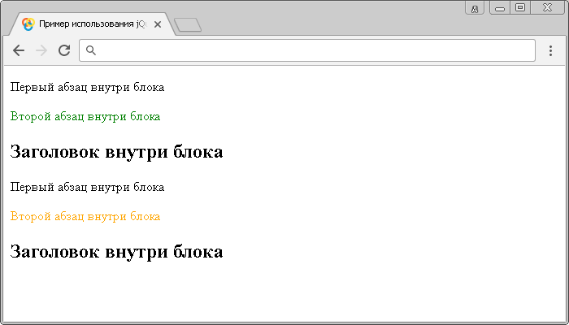

# :eq()

Селектор **`:eq()`** выбирает элемент с определенным (указанным) индексом.

Значение индексов в JavaScript начинается с `0` (нуля), поэтому первый элемент будет иметь индекс `0`, а не `1`. В этом заключается принципиальное отличие от таких селекторов, которые являются частью спецификации CSS, а не библиотеки jQuery и выбирают элементы с определенным порядковым номером в документе, начиная с единицы, а не с нуля.

К селекторам, которые работают с индексами относятся `:eq()`, `:lt()`, `:gt()`, `:even` и `:odd`. Обратите внимание, что последние два jQuery селектора работают именно с индексами, если, например селектор `:even` выбирает нечетные элементы, это значит, что он выбирает все элементы с чётным индексом (`0`, `2`, `4`, `6` и так далее), противоположная ситуация происходит с селектором `:odd`, который выбирает четные элементы (элементы с нечетным индексом - `1`, `3`, `5`, `7` и так далее).

## Синтаксис

```js
// значение отсчитывается от первого элемента (индекс начинается с нуля)
$('selector:eq(index)')

// значение отсчитывается от последнего элемента (-1 соответствует последнему элементу)
$('selector:eq(-index)')
```

Добавлен в версии jQuery

- 1.0 - возможность выбора элементов, отсчитывая от первого элемента.
- 1.8 - возможность выбора элементов, отсчитывая от последнего элемента (возможность использования отрицательного индекса).

## Пример

```html
<!DOCTYPE html>
<html>
  <head>
    <title>Использование jQuery селекторов :first и :last.</title>
    <script src="https://ajax.googleapis.com/ajax/libs/jquery/3.1.0/jquery.min.js"></script>
    <script>
      $(document).ready(function() {
        $('p:eq(1)').css('color', 'green') // выбираем элемент <p> с индексом 1 в документе (второй элемент)
        $('p:eq(-1)').css('color', 'orange') // выбираем элемент <p> с индексом -1 в документе (последний элемент)
      })
    </script>
  </head>
  <body>
    <div>
      <p>Первый абзац внутри блока</p>
      <p>Второй абзац внутри блока</p>
      <h2>Заголовок внутри блока</h2>
    </div>
    <div>
      <p>Первый абзац внутри блока</p>
      <p>Второй абзац внутри блока</p>
      <h2>Заголовок внутри блока</h2>
    </div>
  </body>
</html>
```

В этом примере с использованием селектора `:eq()` мы выбрали и стилизовали второй (с индексом `1`) и последний элемент `<p>` (с индексом `-1`) в документе.

Результат:



Пример использования jQuery селектора `:eq()`.
