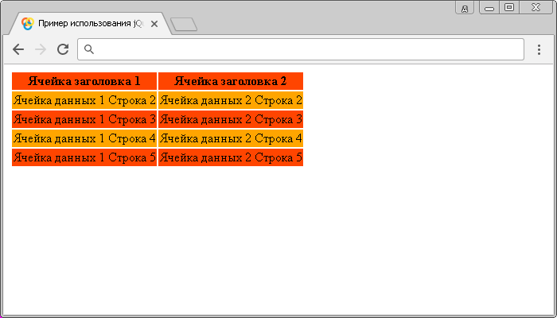

# Селектор :even

Селектор `:even` выбирает каждый элемент с четным индексом (например: `0`, `2`, `4` и так далее), или другими словами выбирает каждый нечетный HTML элемент в документе (например: `1`, `3`, `5` и так далее).

Значение индексов в JavaScript начинается с `0` (нуля), поэтому первый элемент будет иметь индекс `0`, а не `1`.

Для того, чтобы произвести выбор всех четных элементов (элементов с нечетным индексом - `1`, `3`, `5` и так далее), то необходимо воспользоваться jQuery селектором [`:odd`](selector:odd.md).

## Синтаксис

```js
$('selector:even')
```

Добавлен в версии jQuery 1.0

## Пример

```html
<!DOCTYPE html>
<html>
  <head>
    <title>Использование jQuery селекторов :odd и :even.</title>
    <script src="https://ajax.googleapis.com/ajax/libs/jquery/3.1.0/jquery.min.js"></script>
    <script>
      $(document).ready(function() {
        // выбираем каждый нечетный элемент <tr> в документе
        $('tr:even').css('background-color', 'orangered')
        // выбираем каждый четный элемент <tr> в документе
        $('tr:odd').css('background-color', 'orange')
      })
    </script>
  </head>
  <body></body>
</html>
```

В этом примере с использованием селектора `:even` мы выбрали и стилизовали каждый нечетный элемент `<tr>` (строка таблицы) в документе, а с помощью селектора `:odd` мы выбрали каждый четный элемент `<tr>`.

Результат нашего примера:



Пример использования jQuery селекторов `:even` и `:odd`
