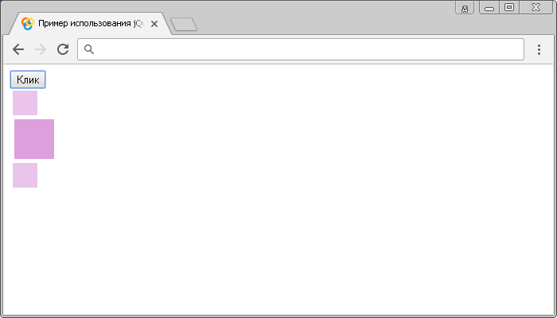

# :hidden

Селектор **`:hidden`** выбирает все элементы, которые скрыты (не занимают место в документе).

Под скрытыми элементами подразумевается:

- Элементы у которых установлено значение `none` у CSS свойства `display`.
- Элементы формы, для которых установлено значение `hidden` в атрибуте `type`.
- В качестве значения ширины и высоты элемента задано нулевое значение.
- Родительский элемент скрыт, в этом случае дочерние элементы также не отображаются.

Этот селектор не выбирает следующие элементы:

- Элементы у которых установлено значение `hidden` у CSS свойства `visibility` (определяет, является ли элемент видимым).
- Элементы у которых установлено значение `0` у CSS свойства `opacity` (прозрачность).

Вышеуказанные элементы не выбираются по той причине, что они считаются видимыми, так как они все еще занимают место в макете страницы.

Селектор `:hidden` является противоположностью селектора `:visible` (каждый элемент, который был выбран одним селектором не будет выбран другим и наоборот).

## Синтаксис

```js
$(':hidden')
```

Добавлен в версии jQuery 1.0

## Пример

```html
<!DOCTYPE html>
<html>
  <head>
    <title>Использование jQuery селектора :hidden.</title>
    <script src="https://ajax.googleapis.com/ajax/libs/jquery/3.1.0/jquery.min.js"></script>
    <script>
      $(document).ready(function() {
        $('button').click(function() {
          // запускаем функцию при клике
          $('div:hidden').show(2500) // выбираем все скрытые div и методом show() отображаем их за 2500 миллисекунд
        })
      })
    </script>
  </head>
  <body>
    <button>Клик</button>
    <div
      style="width:50px;height:50px; margin:5px; background:plum; display:none"
    ></div>
    <div style="width:50px;height:50px; margin:5px; background:plum"></div>
    <div
      style="width:50px;height:50px; margin:5px; background:plum; display:none"
    ></div>
  </body>
</html>
```

В этом примере при нажатии на кнопку мы запускаем функцию, в которой с использованием селектора `:hidden` мы выбираем все элементы `<div>`, которые скрыты (не занимают место в документе), а с помощью метода `.show()` отображаем их за 2500 миллисекунд.

Результат:



Пример использования jQuery селектора `:hidden`.
