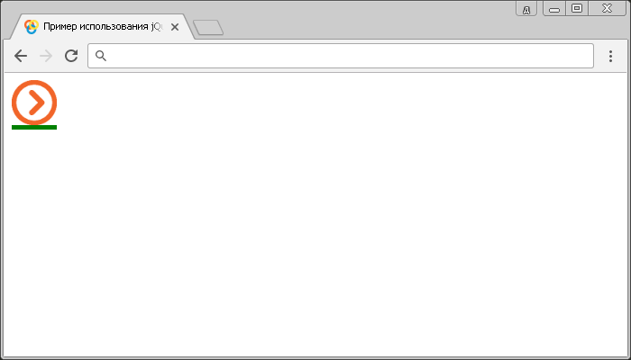

# :image

Селектор **`:image`** выбирает все элементы `<input>`, которые имеют атрибут `type` со значением `button`.

Селектор `:image` эквивалентен следующему селектору атрибутов:

```js
$("[type="image"]")
```

## Синтаксис

```js
$(':image')
```

Добавлен в версии jQuery 1.0

## Пример

```html
<!DOCTYPE html>
<html>
  <head>
    <title>Использование jQuery селектора :image</title>
    <script src="https://ajax.googleapis.com/ajax/libs/jquery/3.1.0/jquery.min.js"></script>
    <script>
      $(document).ready(function() {
        $(':image').css('border-bottom', '5px solid green') // выбираем все элементы <input>, которые имеют атрибут type со значением image.
      })
    </script>
  </head>
  <body>
    <form>
      <input
        type="image"
        src="/images/right2.png"
        alt="submit_image"
        width="50px"
      />
    </form>
  </body>
</html>
```

В этом примере с использованием селектора `:image` мы выбрали и стилизовали все элементы `<input>`, которые имеют атрибут `type` со значением `image`.

Результат:



Пример использования селектора `:image`.
