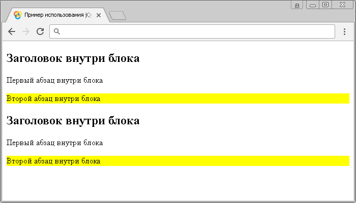

# :last-child

Селектор **`:last-child`** выбирает каждый элемент, который является последним дочерним элементом своего родителя.

Для того, чтобы выбрать элемент, который является последним элементом в документе, вы можете воспользоваться jQuery селектором [`:last`](selector:last.md).

## Синтаксис

```js
$('selector:last-child')
```

Добавлен в версии jQuery 1.1.4

## Пример

```html
<!DOCTYPE html>
<html>
  <head>
    <title>Использование jQuery селектора :last-child</title>
    <script src="https://ajax.googleapis.com/ajax/libs/jquery/3.1.0/jquery.min.js"></script>
    <script>
      $(document).ready(function() {
        $('p:last-child').css('background-color', 'yellow') // выбираем каждый элемент <p>, который является последним дочерним элементом своего родителя.
      })
    </script>
  </head>
  <body>
    <div>
      <h2>Заголовок внутри блока</h2>
      <p>Первый абзац внутри блока</p>
      <p>Второй абзац внутри блока</p>
    </div>
    <div>
      <h2>Заголовок внутри блока</h2>
      <p>Первый абзац внутри блока</p>
      <p>Второй абзац внутри блока</p>
    </div>
  </body>
</html>
```

В этом примере с использованием jQuery селектора `:last-child` мы выбрали каждый элемент `<p>` (абзац), который является последним дочерним элементом своего родителя в документе.

Результат нашего примера:



Пример использования jQuery селектора `:last-child`
