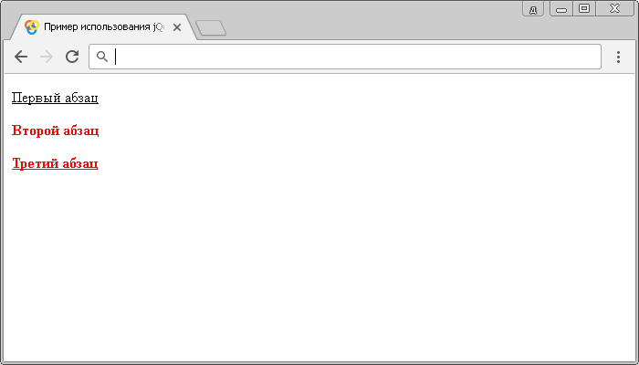

# :not()

Селектор отрицания **`:not`** позволяет выбрать элементы отличные от указанных. Селектор отрицания используется вместе с другим селектором, чтобы выбрать все элементы, кроме указанных в селекторе.

## Синтаксис

```js
$('selector:not(selector)')
```

Отличие от синтаксиса CSS и jQuery при использовании некоторых селекторов:

CSS:

```css
a:not(:last-child) {
}
```

jQuery:

```js
$('a:not(a:last-child)') // необходимо продубировать селектор типа a
```

Добавлен в версии jQuery 1.0

## Пример

```html
<!DOCTYPE html>
<html>
  <head>
    <title>Использование jQuery селектора отрицания :not</title>
    <style>
      p:not(:first-child) {
        /* выбирает все элементы <p>, за исключением тех, которые являются первым дочерним элементом своего родителя */
        font-weight: bold; /* определяет жирное начертание символов */
      }
    </style>
    <script src="https://ajax.googleapis.com/ajax/libs/jquery/3.1.0/jquery.min.js"></script>
    <script>
      $(document).ready(function() {
        $('p:not(p:first-child)').css('color', 'red') // выбирает и стилизует все элементы <p>, за исключением тех, которые являются первым дочерним элементом своего родителя
        $('p:not(.test)').css('text-decoration', 'underline') // выбирает и стилизует все элементы <p>, за исключением тех, которые имеют класс test
      })
    </script>
  </head>
  <body>
    <p>Первый абзац</p>
    <p class="test">Второй абзац</p>
    <p>Третий абзац</p>
  </body>
</html>
```

В этом примере:

- С использованием CSS селектора отрицания селектор `:not` выбрали все элементы `<p>`, за исключением тех, которые являются первыми дочерними элементами своего родителя. В нашем случае это первый абзац и стилизовали установив жирное начертание символов второму и третьему абзацу.
- С использованием селектора отрицания `:not` выбрали и стилизовали (цвет текста красный) все элементы `<p>`, за исключением тех, которые являются первыми дочерним элементами своего родителя (в нашем случае первый абзац). Обратите внимание на отличие в синтаксисе между CSS и jQuery. jQuery необходимо явно указать какой первый дочерний элемент имеется ввиду, в нашем случае мы дублируем селектор типа `p`.
- С использованием селектора отрицания `:not` выбрали и стилизовали (декорирование текста - нижнее подчеркивание) все элементы `<p>`, за исключением тех, глобальный атрибут `class` которых, имеет значение `test`.

Результат:



Пример использования jQuery селектора отрицания `:not`.
