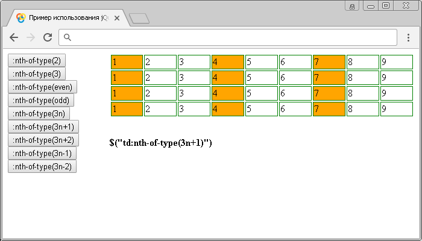

# :nth-of-type()

Селектор **`:nth-of-type`** выбирает каждый указанный элемент определенного типа, который является дочерним элементом своего родительского элемента.

Селектор `:nth-of-type` работает, как и селектор [`:nth-child`](<selector:nth-child().md>), но применяется к чередующимся дочерним элементам определенного типа, а не к элементу с любым типом.

## Синтаксис

```js
$('selector:nth-of-type(номер | ключевое слово | формула)')
```

В качестве значения селектора `:nth-of-type()` может выступать не только порядковый номер дочерних элементов определенного типа, которые необходимо стилизовать, но и ключевые слова, которые могут определять целую группу элементов. В качестве ключевого слова можно использовать два значения:

- `even` (четные элементы определенного типа)
- `odd` (нечетные элементы определенного типа)

Селектор `:nth-of-type()` позволяет выбрать не только чётные, нечетные, или дочерние элементы определенного типа, но и дочерние элементы определенного типа, заданные по элементарной математической формуле:

```js
$('td:nth-of-type(4n+2)')
```

Этот селектор означает, что каждая четвёртая ячейка данных таблицы (`<td>`) внутри строки, начиная со второй ячейки данных таблицы, будет выбрана:

- `4n` – каждый четвертый элемент определенного типа.
- `2` – с какого элемента определенного типа начинать.

В формулах допускается использование значений со знаком вычитания, но в этом как правило нет необходимости:

```js
$('td:nth-of-type(4n-1)')
```

Этот селектор означает, что каждая четвёртая ячейка данных таблицы (`<td>`) внутри строки, начиная с третьей ячейки данных таблицы (порядкового номера `-1` нет по объективным причинам, поэтому происходит сдвиг), будет выбрана:

- `4n` – каждый четвертый элемент определенного типа.
- `-1` – с какого элемента определенного типа начинать.

Добавлен в версии jQuery 1.9

## Пример

```html
<!DOCTYPE html>
<html>
  <head>
    <title>Использование jQuery селектора :nth-of-type</title>
    <style>
      CSS стили
    </style>
    <script src="https://ajax.googleapis.com/ajax/libs/jquery/3.1.0/jquery.min.js"></script>
    <script>
      $(document).ready(function(){
        $("button").click(function(){
          var str = $(this).text();
          $("td").css("background", "#fff");
          $("td" + str ).css("background", "orange");
          $(".info").text('$("td'+str+'")');
      });
    </script>
  </head>
  <body>
    <div class="control">
      <button>:nth-of-type(2)</button>
      <button>:nth-of-type(3)</button>
      <button>:nth-of-type(even)</button>
      <button>:nth-of-type(odd)</button>
      <button>:nth-of-type(3n)</button>
      <button>:nth-of-type(3n+1)</button>
      <button>:nth-of-type(3n+2)</button>
      <button>:nth-of-type(3n-1)</button>
      <button>:nth-of-type(3n-2)</button>
    </div>
    <table>
      <tr>
        <td>1</td>
        <td>2</td>
        <td>3</td>
        <td>4</td>
        <td>5</td>
        <td>6</td>
        <td>7</td>
        <td>8</td>
        <td>9</td>
      </tr>
      <tr>
        <td>1</td>
        <td>2</td>
        <td>3</td>
        <td>4</td>
        <td>5</td>
        <td>6</td>
        <td>7</td>
        <td>8</td>
        <td>9</td>
      </tr>
      <tr>
        <td>1</td>
        <td>2</td>
        <td>3</td>
        <td>4</td>
        <td>5</td>
        <td>6</td>
        <td>7</td>
        <td>8</td>
        <td>9</td>
      </tr>
      <tr>
        <td>1</td>
        <td>2</td>
        <td>3</td>
        <td>4</td>
        <td>5</td>
        <td>6</td>
        <td>7</td>
        <td>8</td>
        <td>9</td>
      </tr>
    </table>

    <div class="info"></div>
  </body>
</html>
```

В этом интерактивном примере с использованием селектора `:nth-of-type` выбираем и стилизуем элементы `<td>` (ячейка данных) в зависимости от их размещения (элементы определенного типа, которые является дочерним элементами своих родительских элементов).

Выбор ячеек данных таблицы по элементарной математической формуле:


