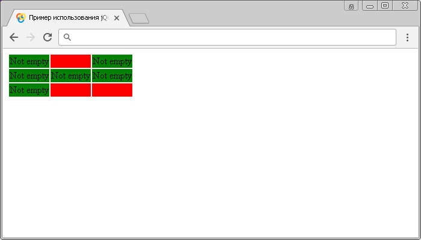

# :parent

Селектор **`:parent`** выбирает все элементы, которые имеют по крайней мере один дочерний узел (элемент или текст).

Обращаю Ваше внимание, что для того, чтобы выбрать пустые элементы (не имеют дочерних элементов и текстовых узлов) вы можете воспользоваться селектором `:empty`.

## Синтаксис

```js
$(':parent')
```

Добавлен в версии jQuery 1.0

## Пример

```html
<!DOCTYPE html>
<html>
  <head>
    <title>Использование jQuery селекторов :empty и :parent.</title>
    <script src="https://ajax.googleapis.com/ajax/libs/jquery/3.1.0/jquery.min.js"></script>
    <script>
      $(document).ready(function() {
        $('td:empty').css('background-color', 'red') // выбираем пустые ячейки таблицы
        $('td:parent').css('background-color', 'green') // выбираем не пустые ячейки таблицы
      })
    </script>
  </head>
  <body>
    <table>
      <tr>
        <td>Not empty</td>
        <td></td>
        <td>Not empty</td>
      </tr>
      <tr>
        <td>Not empty</td>
        <td>Not empty</td>
        <td>Not empty</td>
      </tr>
      <tr>
        <td>Not empty</td>
        <td></td>
        <td></td>
      </tr>
    </table>
  </body>
</html>
```

В этом примере с использованием селектора `:empty` мы выбрали и стилизовали все ячейки данных таблицы (элементы `<td>`), а с помощью селектора `:parent`, который является противоположностью селектора `:empty`, выбрали и стилизовали ячейки таблицы, которые содержат текстовую информацию (не пустые).

Результат нашего примера:



Пример использования jQuery селекторов `:empty` и `:parent`.
