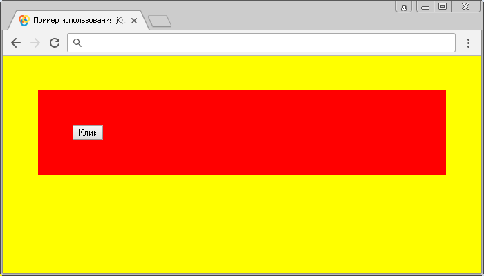

# :root

Селектор **`:root`** выбирает корневой элемент в документе, в HTML корневым элементом всегда является элемент `<html>`.

## Синтаксис

```js
$(':root')
```

Добавлен в версии jQuery 1.9

## Пример

```html
<!DOCTYPE html>
<html>
  <head>
    <title>Использование jQuery селектора :root</title>
    <script src="https://ajax.googleapis.com/ajax/libs/jquery/3.1.0/jquery.min.js"></script>
    <script>
      $(document).ready(function() {
        $('button').click(function() {
          // запускаем функцию при клике
          $(':root').css('background-color', 'yellow') // устанавливаем фон для корневого элемента
        })
      })
    </script>
  </head>
  <body>
    <button>Клик</button>
  </body>
</html>
```

В этом примере с использованием селектора `:root` мы выбрали и стилизовали корневой элемент.

Результат нашего примера:



Пример использования jQuery селектора `:root`.
