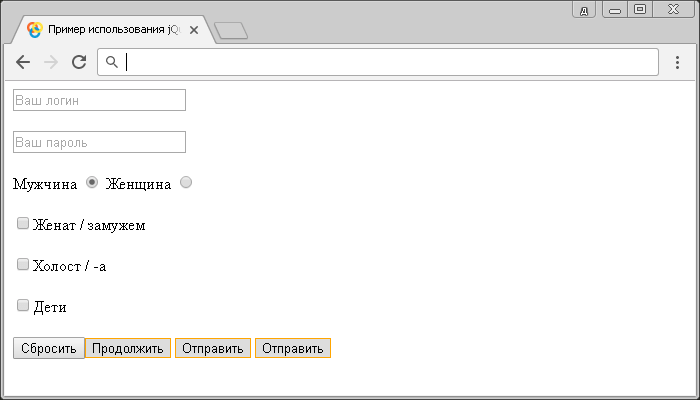

# :submit

Селектор **`:submit`** выбирает все элементы `<input>` и `<button>`, которые имеют атрибут `type` со значением `submit` и элемент `<button>`, который не имеет атрибута `type`.

## Синтаксис

```js
$(':submit')
```

Добавлен в версии jQuery 1.0

## Пример

```html
<!DOCTYPE html>
<html>
  <head>
    <title>Использование jQuery селектора :submit</title>
    <script src="https://ajax.googleapis.com/ajax/libs/jquery/3.1.0/jquery.min.js"></script>
    <script>
      $(document).ready(function() {
        $(':submit').css('border', '1px solid orange') // выбираем все элементы <input> и <button>, которые имеют атрибут type со значением submit и элемент button, который не имеет атрибута type.
      })
    </script>
  </head>
  <body>
    <form>
      <input type="text" placeholder="Ваш логин" /><br /><br />
      <input type="password" placeholder="Ваш пароль" /><br /><br />
      <label
        >Мужчина <input type="radio" name="sex" value="male" checked
      /></label>
      <label>Женщина <input type="radio" name="sex" value="female"/></label
      ><br /><br />
      <label
        ><input type="checkbox" name="type1" value="busy" />Женат /
        замужем</label
      ><br /><br />
      <label
        ><input type="checkbox" name="type2" value="free" />Холост / -а</label
      ><br /><br />
      <label><input type="checkbox" name="type3" value="childfree" />Дети</label
      ><br /><br />
      <input type="reset" /><input type="submit" value="Продолжить" />
      <button type="submit">Отправить</button>
      <button>Отправить</button>
    </form>
  </body>
</html>
```

В этом примере с использованием селектора `:submit` мы выбрали и стилизовали все элементы `<input>` и `<button>`, которые имеют атрибут `type` со значением `submit` и элемент `<button>`, который не имеет атрибута `type`.

Результат:



Пример использования селектора `:submit`.
