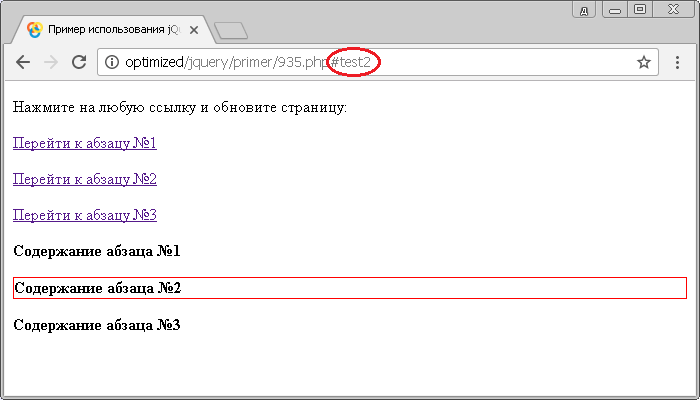

# :target

Если идентификатор ресурса (URI) документа содержит фрагмент идентификатора элемента, то селектор **`:target`** выбирет элемент с подобным идентификатором (глобальный атрибут `id`). Например, элемент `<p id="info">` будет выбран так как URI документа (`http://пример.ру/#info`) содержит фрагмент идентификатора этого элемента.

## Синтаксис

```js
$(':target')
```

Добавлен в версии jQuery 1.9

## Пример

```html
<!DOCTYPE html>
<html>
  <head>
    <title>Использование jQuery селектора :target</title>
    <script src="https://ajax.googleapis.com/ajax/libs/jquery/3.1.0/jquery.min.js"></script>
    <script>
      $(document).ready(function() {
        $(':target').css('border', '1px solid red') // выбираем элементы, чей фрагмент идентификатора элемента содержится в URI документа
      })
    </script>
  </head>
  <body>
    <p>Нажмите на любую ссылку и обновите страницу:</p>
    <p><a href="#test1">Перейти к абзацу №1</a></p>
    <p><a href="#test2">Перейти к абзацу №2</a></p>
    <p><a href="#test3">Перейти к абзацу №3</a></p>
    <p id="test1"><b>Содержание абзаца №1</b></p>
    <p id="test2"><b>Содержание абзаца №2</b></p>
    <p id="test3"><b>Содержание абзаца №3</b></p>
  </body>
</html>
```

В этом примере с использованием селектора `:target` выбираем и стилизуем элементы, чей фрагмент идентификатора элемента (глобальный атрибут `id`) содержится в URI документа

Результат:



Пример использования селектора `:target`.
