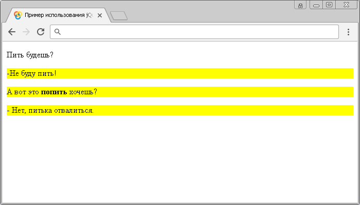

# :contains()

Селектор **`:contains()`** выбирает все элементы, которые содержат указанную строку. Строки могут находиться непосредственно в самом элементе, или внутри дочернего элемента.

Обращаю Ваше внимание на то, что текст является чувствительным к регистру.

## Синтаксис

```js
$('selector:contains(text)')
```

Добавлен в версии jQuery 1.1.4

## Пример

```html
<!DOCTYPE html>
<html>
  <head>
    <title>Использование jQuery селектора :contains</title>
    <script src="https://ajax.googleapis.com/ajax/libs/jquery/3.1.0/jquery.min.js"></script>
    <script>
      $(document).ready(function() {
        $('p:contains(пить)').css('background-color', 'yellow') // выбираем все элементы <p>, которые содержат строку "пить"
      })
    </script>
  </head>
  <body>
    <p>Пить будешь?</p>
    <p>- Не буду пить!</p>
    <p>А вот это <span style="font-weight:bold">попить</span> хочешь?</p>
    <p>- Нет, питька отвалиться.</p>
  </body>
</html>
```

В этом примере с использованием селектора `:contains()` мы выбрали и стилизовали все абзацы (элементы `<p>`), которые содержат в себе строку "пить". Обратите внимание, что был выбран и второй абзац не смотря на то, что искомая строка находится в дочернем элементе. В связи с тем, что поиск чувствителен к регистру, первый абзац не был выбран.

Результат нашего примера:



Пример использования jQuery селектора `:contains()`.
