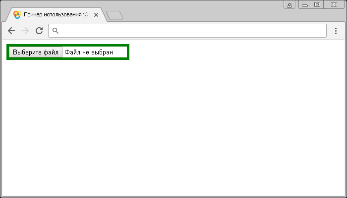

# :file

Селектор **`:file`** выбирает все элементы `<input>`, которые имеют атрибут `type` со значением `file`.

Селектор `:file` эквивалентен следующему селектору атрибутов:

```js
$('[type="file"]')
```

## Синтаксис

```js
$(':file')
```

Добавлен в версии jQuery 1.0

## Пример

```html
<!DOCTYPE html>
<html>
  <head>
    <title>Использование jQuery селектора :file</title>
    <script src="https://ajax.googleapis.com/ajax/libs/jquery/3.1.0/jquery.min.js"></script>
    <script>
      $(document).ready(function() {
        // выбираем все элементы <input>, которые имеют атрибут type со значением file.
        $(':file').css('border', '5px solid green')
      })
    </script>
  </head>
  <body>
    <form>
      <input type="file" />
    </form>
  </body>
</html>
```

В этом примере с использованием селектора `:file` мы выбрали и стилизовали все элементы `<input>`, которые имеют атрибут `type` со значением `file`.

Результат:



Пример использования jQuery селектора `:file`.
