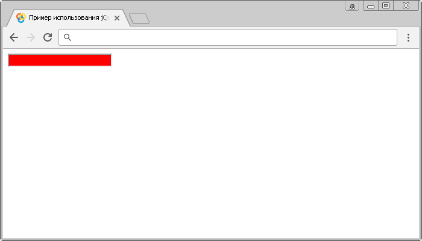

# :focus

Селектор **`:focus`** определяет какой элемент находится в фокусе в данный момент.

## Синтаксис

```js
$(':focus')
```

Рекомендуется использовать следующий синтаксис:

```js
$('selector:focus')
```

Если не использовать селектор, то выборка происходит медленно по причине использования универсального селектора:

```js
$('*:focus')
```

Вы можете определить элемент, который в текущий момент находится в фокусе без обхода дерева DOM:

```js
$(document.activeElement)
```

Добавлен в версии jQuery 1.6

## Селектор в CSS

Это селектор jQuery, он не является частью спецификации CSS.

Если Вам необходимо стилизовать элемент при фокусе на нем (по аналогии с CSS псевдоклассом `:focus`), то вы можете воспользоваться следующим скриптом:

```js
$(document).ready(function() {
  $('input').focus(function() {
    $(this).css('background', 'khaki')
  })
  $('input').blur(function() {
    $(this).css('background', '#fff')
  })
})
```

## Пример

```html
<!DOCTYPE html>
<html>
  <head>
    <title>Использование jQuery селектора :focus</title>
    <script src="https://ajax.googleapis.com/ajax/libs/jquery/3.1.0/jquery.min.js"></script>
    <script>
      $(document).ready(function() {
        $('input').focus() // используя метод focus() добавляем событие фокус к элементу
        $(':focus').css('background-color', 'red') // задаем цвет заднего фона
      })
    </script>
  </head>
  <body>
    <input type="text" />
  </body>
</html>
```

Результат нашего примера:



Пример использования селектора `:focus`.
