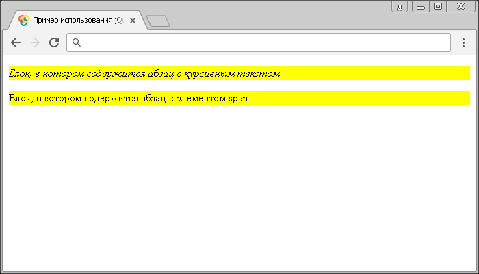

# :has()

Селектор **`:has`** выбирает все элементы, которые имеют один или более элемент, содержащийся внутри них. Вложенные элементы могут находиться как в качестве дочернего элемента, так и потомка.

## Синтаксис

```js
$(':has(selector)')

// Для выбора элемента, который имеет в себе любой из перечисленных элементов:
$(':has(selector, selector)')
```

Добавлен в версии jQuery 1.1.4

## Пример

```html
<!DOCTYPE html>
<html>
  <head>
    <title>Использование jQuery селектора :has.</title>
    <script src="https://ajax.googleapis.com/ajax/libs/jquery/3.1.0/jquery.min.js"></script>
    <script>
      $(document).ready(function() {
        $('div:has(i, span)').css('background-color', 'yellow') // выбираем элементы div, которые содержат в себе элементы i, или span
      })
    </script>
  </head>
  <body>
    <div>
      <p><i>Блок, в котором содержится абзац с курсивным текстом</i></p>
    </div>
    <div>
      <p>Блок, в котором содержится абзац c элементом<span>span</span>.</p>
    </div>
  </body>
</html>
```

В этом примере с использованием селектора `:has` мы выбрали и стилизовали блоки (элементы `<div>`), которые содержат в себе элементы `<i>`, или `<span>`. В нашем случае было стилизовано оба блока, так как первый содержит в себе элемент `<i>`, а второй блок элемент `<span>`.

Результат:



Пример использования jQuery селектора `:has`.
