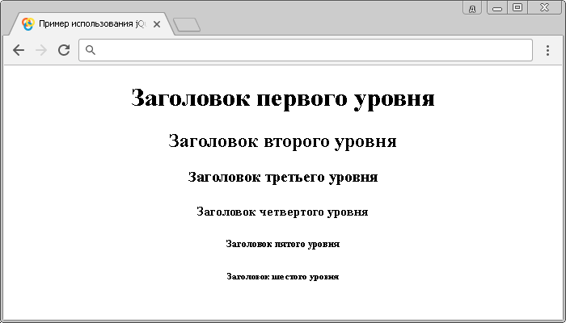

# :header

Селектор **`:header`** выбирает все элементы, которые являются заголовками.

## Синтаксис

```js
$(':header')
```

Добавлен в версии jQuery 1.2

## Пример

```html
<!DOCTYPE html>
<html>
  <head>
    <title>Использование jQuery селектора :header.</title>
    <script src="https://ajax.googleapis.com/ajax/libs/jquery/3.1.0/jquery.min.js"></script>
    <script>
      $(document).ready(function() {
        $(':header').css('text-align', 'center') // выбираем и стилизуем все элементы, которые являются заголовками
      })
    </script>
  </head>
  <body>
    <h1>Заголовок первого уровня</h1>
    <h2>Заголовок второго уровня</h2>
    <h3>Заголовок третьего уровня</h3>
    <h4>Заголовок четвертого уровня</h4>
    <h5>Заголовок пятого уровня</h5>
    <h6>Заголовок шестого уровня</h6>
  </body>
</html>
```

В этом примере с использованием селектора `:header` мы выбрали и стилизовали все элементы (выровняли текст по центру страницы), которые являются заголовками (элементы от `<h1>` до `<h6>`).

Результат:



Пример использования jQuery селектора `:header`.
