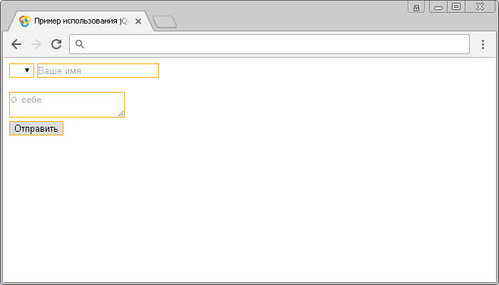

# :input

Селектор **`:input`** выбирает все элементы `<input>` (пользовательское поле для ввода информации), `<textarea>` (поле формы для создания области многострочного ввода), `<select>` (раскрывающийся (выпадающий) список) и `<button>` (используется для размещения кнопки).

## Синтаксис

```js
$(':input')
```

Добавлен в версии jQuery 1.0

## Пример

```html
<!DOCTYPE html>
<html>
  <head>
    <title>Использование jQuery селектора :input.</title>
    <script src="https://ajax.googleapis.com/ajax/libs/jquery/3.1.0/jquery.min.js"></script>
    <script>
      $(document).ready(function() {
        // выбираем все элементы <input>, <textarea>, <select> и <button> в документе
        $(':input').css('border', '1px solid orange')
      })
    </script>
  </head>
  <body>
    <form>
      <!-- указываем, что элемент раскрывающегося списка
			 должен быть выбран перед отправкой формы -->
      <select required>
        <option></option>
        <option>М</option>
        <option>Ж</option>
      </select>
      <!-- однострочное текстовое поле -->
      <input type="text" placeholder="Ваше имя" /><br /><br />
      <!-- область многострочного ввода-->
      <textarea placeholder="О себе"></textarea><br />
      <button>Отправить</button>
      <!-- кнопка -->
    </form>
  </body>
</html>
```

В этом примере с использованием селектора `:input` мы выбрали и стилизовали все элементы `<input>`, `<textarea>`, `<select>` и `<button>` в документе.

Результат:



Пример использования селектора `:input`.
