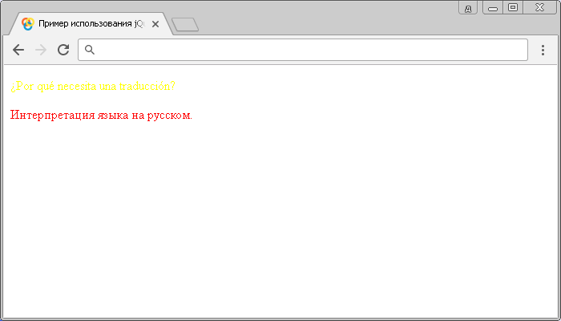

# :lang()

Селектор **`:lang`** выбирает каждый элемент, глобальный атрибут `lang` которого, содержит определённое значение (код языка).

## Синтаксис

```js
$(':lang(language)')
```

Добавлен в версии jQuery 1.9

## Пример

```html
<!DOCTYPE html>
<html>
  <head>
    <title>Использование jQuery селектора :lang</title>
    <script src="https://ajax.googleapis.com/ajax/libs/jquery/3.1.0/jquery.min.js"></script>
    <script>
      $(document).ready(function() {
        $('p:lang(es)').css('color', 'yellow') // устанавливаем цвет для абзаца на испанском
        $('p:lang(ru)').css('color', 'red') // устанавливаем цвет для абзаца на русском
      })
    </script>
  </head>
  <body>
    <p lang="es">¿Por qué necesita una traducción?</p>
    <!-- Этот параграф интерпретируется как испанский -->
    <p lang="ru">Интерпретация языка на русском.</p>
  </body>
</html>
```

В этом примере с использованием селектора `:lang()` мы стилизовали абзацы в зависимости от значения глобального атрибута `lang`. В первом абзаце указан код языка - испанский, а во втором - русский язык.

Результат нашего примера:



Пример использования jQuery селектора `:lang`.
