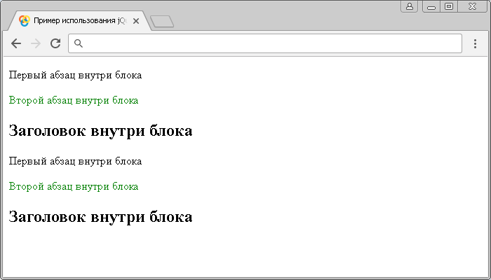

# :last-of-type

Селектор **`:last-of-type`** выбирает каждый элемент, который является последним дочерним элементом определенного типа внутри родительского элемента.

Отличие селектора `:last-of-type` от [`:last-child`](selector:last-child.md) заключается в том, что он выбирает последний дочерний элемент определенного типа, а не последний дочерний элемент этого типа.

Для того, чтобы выбрать элемент, который является последним элементом в документе, вы можете воспользоваться селектором [`:last`](selector:last.md).

## Синтаксис

```js
$('selector:last-of-type')
```

Добавлен в версии jQuery 1.9

## Пример

```html
<!DOCTYPE html>
<html>
  <head>
    <title>Использование jQuery селектора :last-of-type</title>
    <script src="https://ajax.googleapis.com/ajax/libs/jquery/3.1.0/jquery.min.js"></script>
    <script>
      $(document).ready(function() {
        $('p:last-of-type').css('color', 'green') // выбираем каждый элемент <p>, который является последним дочерним элементом определенного типа внутри родительского элемента.
      })
    </script>
  </head>
  <body>
    <div>
      <p>Первый абзац внутри блока</p>
      <p>Второй абзац внутри блока</p>
      <h2>Заголовок внутри блока</h2>
    </div>
    <div>
      <p>Первый абзац внутри блока</p>
      <p>Второй абзац внутри блока</p>
      <h2>Заголовок внутри блока</h2>
    </div>
  </body>
</html>
```

В этом примере с использованием селектора `:last-of-type` мы выбрали каждый элемент `<p>` (абзац), который является последним дочерним элементом определенного типа внутри родительского элемента. Обратите внимание, что если мы используем вместо селектора `:last-of-type` селектор `:last-child`, то он не выберет ниодного элемента `<p>`, так как эти элементы не являются последними дочерними элементами своего родителя.

Результат:


