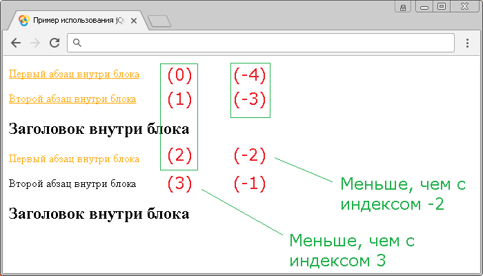

# :lt()

Селектор **`:lt()`** (less than, меньше чем) выбирает элементы с порядковыми номерами меньше, чем указанное число.

Значение индексов в JavaScript начинается с `0` (нуля), поэтому первый элемент будет иметь индекс `0`, а не `1`. В этом заключается принципиальное отличие от таких селекторов, которые являются частью спецификации CSS, а не библиотеки jQuery и выбирают элементы с определенным порядковым номером в документе, начиная с единицы, а не с нуля.

К селекторам, которые работают с индексами относятся `:lt()`, `:gt()`, `:eq()`, `:even` и `:odd`. Последние два селектора работают именно с индексами, если, например селектор `:even` выбирает нечетные элементы, это значит, что он выбирает все элементы с чётным индексом (`0`, `2`, `4`, `6` и так далее), противоположная ситуация происходит с jQuery селектором `:odd`, который выбирает четные элементы (элементы с нечетным индексом - `1`, `3`, `5`, `7` и так далее).

Чтобы выбрать элементы с порядковыми номерами выше, чем указанное число, необходимо воспользоваться jQuery селектором `:gt()`.

## Синтаксис

```js
// значение отсчитывается от первого элемента (индекс начинается с нуля)
$('selector:lt(index)')

// значение отсчитывается от последнего элемента (-1 соответствует последнему элементу)
$('selector:lt(-index)')
```

Добавлен в версии jQuery

- 1.0 - возможность выбора элементов, отсчитывая от первого элемента.
- 1.8 - возможность выбора элементов, отсчитывая от последнего элемента (возможность использования отрицательного индекса).

## Пример

```html
<!DOCTYPE html>
<html>
  <head>
    <title>Использование jQuery селектора :lt.</title>
    <script src="https://ajax.googleapis.com/ajax/libs/jquery/3.1.0/jquery.min.js"></script>
    <script>
      $(document).ready(function() {
        $('p:lt(-2)').css('text-decoration', 'underline') // выбираем все элементы <p> в документе с индексом меньше, чем -2
        $('p:lt(3)').css('color', 'orange') // выбираем все элементы <p> в документе с индексом меньше, чем 3
      })
    </script>
  </head>
  <body>
    <div>
      <p>Первый абзац внутри блока</p>
      <p>Второй абзац внутри блока</p>
      <h2>Заголовок внутри блока</h2>
    </div>
    <div>
      <p>Первый абзац внутри блока</p>
      <p>Второй абзац внутри блока</p>
      <h2>Заголовок внутри блока</h2>
    </div>
  </body>
</html>
```

В этом примере с использованием селектора `:lt()` мы выбрали и стилизовали элементы `<p>`, чей индекс меньше -2 (добавили декорирование текста - нижнее подчеркивание), и чей индекс меньше чем 3 (установили цвет текста оранжевый).

Результат нашего примера:



Пример использования jQuery селектора `:lt()`.
