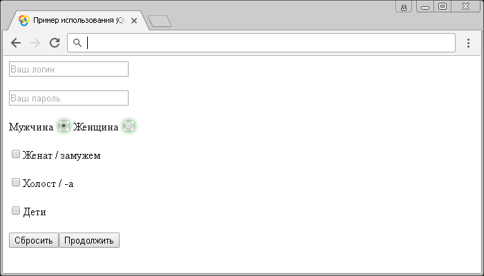

# :radio

Селектор **`:radio`** выбирает все элементы `<input>`, которые имеют атрибут `type` со значением `checkbox`.

## Синтаксис

```js
$(':radio')
```

Добавлен в версии jQuery 1.0

## Пример

```html
<!DOCTYPE html>
<html>
  <head>
    <title>Использование jQuery селектора :radio.</title>
    <script src="https://ajax.googleapis.com/ajax/libs/jquery/3.1.0/jquery.min.js"></script>
    <script>
      $(document).ready(function() {
        // выбираем все элементы <input>, которые имеют атрибут type со значением checkbox
        $(':radio').css('box-shadow', '0 0 10px green')
      })
    </script>
  </head>
  <body>
    <form>
      <input type="text" placeholder="Ваш логин" /><br /><br />
      <input type="password" placeholder="Ваш пароль" /><br /><br />
      <label
        >Мужчина <input type="radio" name="sex" value="male" checked
      /></label>
      <label>Женщина <input type="radio" name="sex" value="female"/></label
      ><br /><br />
      <label
        ><input type="checkbox" name="type1" value="busy" />Женат /
        замужем</label
      ><br /><br />
      <label
        ><input type="checkbox" name="type2" value="free" />Холост / -а</label
      ><br /><br />
      <label><input type="checkbox" name="type3" value="childfree" />Дети</label
      ><br /><br />
      <input type="reset" /><input type="submit" value="Продолжить" />
    </form>
  </body>
</html>
```

В этом примере с использованием селектора `:radio` мы выбрали и стилизовали все элементы `<input>`, которые имеют атрибут `type` со значением `checkbox`.

Результат:



Пример использования селектора `:radio`.
