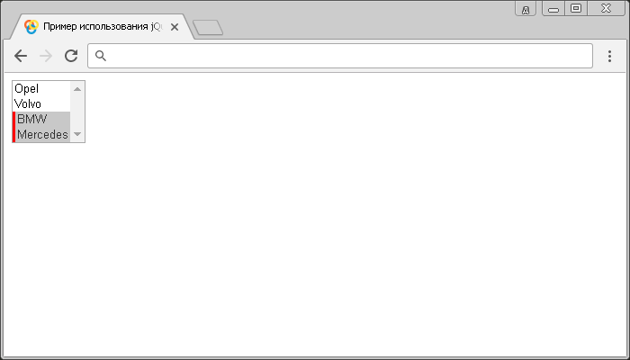

# :selected

Селектор **`:selected`** выбирает все элементы `<option>`, у которых установлен логический атрибут `selected`.

## Синтаксис

```js
$(':selected')
```

Добавлен в версии jQuery 1.0

## Пример

```html
<!DOCTYPE html>
<html>
  <head>
    <title>Использование jQuery селектора :selected.</title>
    <script src="https://ajax.googleapis.com/ajax/libs/jquery/3.1.0/jquery.min.js"></script>
    <script>
      $(document).ready(function() {
        $(':selected').css('border-left', '3px solid red') // выбираем все элементы <option>, которые имеют логический атрибут selected
      })
    </script>
  </head>
  <body>
    <select name="cars" multiple>
      <!--раскрывающийся список в котором может быть выбрано несколько значений (атрибут multiple) -->
      <option value="Opel">Opel</option>
      <option value="Volvo">Volvo</option>
      <option value="BMW" selected>BMW</option>
      <!-- параметр должен быть предварительно выбран при загрузке (атрибут selected) -->
      <option value="Mercedes" selected>Mercedes</option>
      <!-- параметр должен быть предварительно выбран при загрузке (атрибут selected) -->
    </select>
  </body>
</html>
```

В этом примере с использованием селектора `:selected` мы выбрали и стилизовали все элементы `<option>`, у которых установлен логический атрибут `selected`.

Результат:



Пример использования селектора `:selected`.
