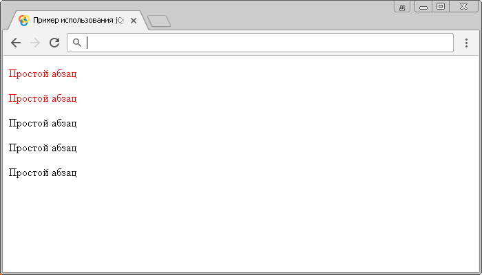

# селектор атрибутов [attribute|='value']

Селектор атрибутов `[attribute|='value']` выбирает элементы, которые имеют указанный атрибут со значением равным заданной строке, или значение начинается с этой строки и сразу после этой строки следует дефис (значение чувствительно к регистру).

## Синтаксис

```js
$("[attribute|='value']")
```

Добавлен в версии jQuery 1.0

## Пример

```html
<!DOCTYPE html>
<html>
  <head>
    <title>Использование jQuery селектора атрибутов [attribute|='value']</title>
    <script src="https://ajax.googleapis.com/ajax/libs/jquery/3.1.0/jquery.min.js"></script>
    <script>
      $(document).ready(function() {
        // выбираем все HTML элементы <p>, которые имеют указанный атрибут со значением
        // равным заданной строке, или значение начинается с этой строки и сразу после
        // этой строки следует дефис и устанавливаем цвет текста - красный
        $("p[title|='подсказка']").css('color', 'red')
      })
    </script>
  </head>
  <body>
    <p title="подсказка">Простой абзац</p>
    <p title="подсказка-1">Простой абзац</p>
    <p title="Подсказка">Простой абзац</p>
    <p title="подсказка подсказка">Простой абзац</p>
    <p title="-подсказка">Простой абзац</p>
  </body>
</html>
```

В этом примере с использованием jQuery селектора атрибутов `[attribute|='value']` мы выбрали все элементы `<p>` в документе, которые содержат глобальный атрибут `title` со значением равным заданной строке, или значение начинается с этой строки и сразу после этой строки следует дефис, и стилизовали их с использованием CSS свойства `color` (цвет текста)

Результат:



Пример использования jQuery селектора атрибутов `[attribute|='value']`.
