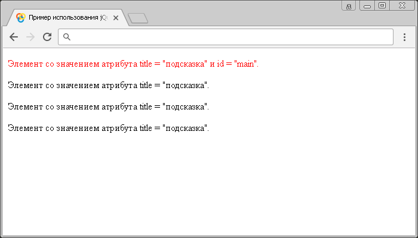

# Селектор атрибутов с несколькими значениями

**Селектор атрибутов с несколькими значениями** выбирает элементы, которые удовлетворяют всем указанным фильтрам атрибута.

## Синтаксис

```js
// в качестве фильтра может быть использован любой селектор атрибутов
$('[attributeFilter1][attributeFilter2][attributeFilterN]')
```

Добавлен в версии jQuery 1.0

## Пример

```html
<!DOCTYPE html>
<html>
  <head>
    <title>
      Использование jQuery селектора атрибутов (с несколькими значениями)
    </title>
    <script src="https://ajax.googleapis.com/ajax/libs/jquery/3.1.0/jquery.min.js"></script>
    <script>
      $(document).ready(function() {
        // выбираем все HTML элементы <p> с атрибутом title со значением 'подсказка'
        // и с атрибутом id, и устанавливаем цвет текста - красный
        $("[title='подсказка'][id]").css('color', 'red')
      })
    </script>
  </head>
  <body>
    <p title="подсказка" id="main">
      Элемент со значением атрибута title = "подсказка" и id = "main".
    </p>
    <p title="подсказка">Элемент со значением атрибута title = "подсказка".</p>
    <p title="подсказка">Элемент со значением атрибута title = "подсказка".</p>
    <p title="подсказка">Элемент со значением атрибута title = "подсказка".</p>
  </body>
</html>
```

В этом примере с использованием jQuery селектора атрибутов (с несколькими значениями) мы выбрали все элементы `<p>` в документе, которые содержат глобальный атрибут `title` со значением "подсказка" и с глобальным арибутом `id`, и стилизовали их с использованием CSS свойства `color` (цвет текста).

Результат:



Пример использования jQuery селектора атрибутов с несколькими значениями.
