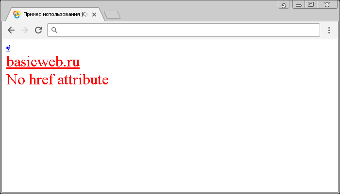

# Селектор атрибутов [attribute!='value']

Селектор **`[attribute!='value']`** выбирает элементы, которые либо не имеют указанный атрибут, или имеют указанный атрибут, но не с определенным значением.

Селектор атрибутов `[attribute!='value']` эквивалентен следующему селектору отрицания:

```js
$("selector:not([attribute='value'])")
```

## Синтаксис

```js
$("[attribute!='value']")
$("selector[attribute!='value']")
```

Добавлен в версии jQuery 1.0

## Пример

```html
<!DOCTYPE html>
<html>
  <head>
    <title>Использование jQuery селектора атрибутов [attribute!='value']</title>
    <script src="https://ajax.googleapis.com/ajax/libs/jquery/3.1.0/jquery.min.js"></script>
    <script>
      $(document).ready(function() {
        // выбираем все HTML элементы <a>, которые либо не имеют атрибут href,
        // или имеют атрибут href, но не со значением #
        $("a[href!='#']").css('color', 'red')

        // выбираем все HTML элементы <a>, которые либо не имеют атрибут href,
        // или имеют атрибут href, но не со значением #
        $("a:not([href='#'])").css('font-size', '2em')
      })
    </script>
  </head>
  <body>
    <a href="#">#</a><br />
    <a href="basicweb.ru">basicweb.ru</a><br />
    <a>No href attribute</a>
  </body>
</html>
```

В этом примере с использованием jQuery селектора атрибутов `[attribute!='value']` мы выбрали все элементы `<a>` (гиперссылки) в документе, которые, либо не имеют атрибут `href`, или имеют атрибут `href`, но не со значением `#` и стилизовали их с использованием CSS свойства `color` (цвет текста). Кроме того с использованием jQuery селектора отрицания мы выбрали те же элементы и установили для них размер шрифта `2em`.

Результат:



Пример использования jQuery селектора атрибутов [attribute!='value'] (не с атрибутом и атрибутом с определенным значением).
