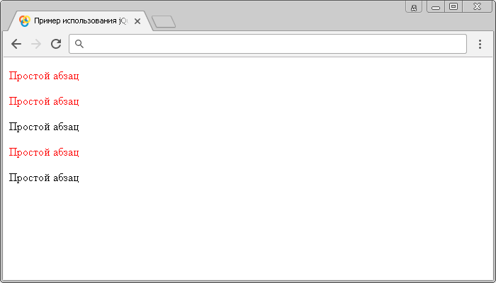

# Селектор атрибутов [attribute^='value']

Селектор атрибутов `[attribute^='value']` выбирает каждый элемент, значение атрибута которого, начинается с указанного значения (значение чувствительно к регистру).

## Синтаксис

```js
$("[attribute^='value']")
```

Добавлен в версии jQuery 1.0

## Пример

```html
<!DOCTYPE html>
<html>
  <head>
    <title>Использование jQuery селектора атрибутов [attribute^='value']</title>
    <script src="https://ajax.googleapis.com/ajax/libs/jquery/3.1.0/jquery.min.js"></script>
    <script>
      $(document).ready(function() {
        $("p[title^='подсказка']").css('color', 'red') // выбираем все HTML элементы <p>, атрибут title которых начинаеися заданными символами и устанавливаем цвет текста - красный
      })
    </script>
  </head>
  <body>
    <p title="подсказка">Простой абзац</p>
    <p title="подсказка-1">Простой абзац</p>
    <p title="Подсказка">Простой абзац</p>
    <p title="подсказка подсказка">Простой абзац</p>
    <p title="-подсказка">Простой абзац</p>
  </body>
</html>
```

В этом примере с использованием селектора атрибутов `[attribute^='value']` мы выбрали все элементы `<p>` в документе, которые содержат глобальный атрибут `title` со значением начинающимся с символов "подсказка" и стилизовали их с использованием CSS свойства `color` (цвет текста)

Результат нашего примера:



Пример использования jQuery селектора атрибутов `[attribute^='value']` (значение начинается с определённых символов).
