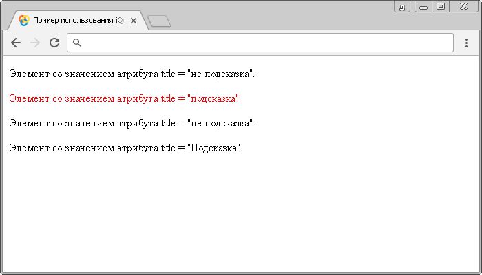

# Селектор атрибутов с определенным значением

**Селектор атрибутов с определенным значением** выбирает элементы, которые имеют как указанный атрибут, так и определенное значение.

## Синтаксис

```js
$("[attribute="value"]")
```

Добавлен в версии jQuery 1.0

## Пример

```html
<!DOCTYPE html>
<html>
  <head>
    <title>
      Использование jQuery селектора атрибутов (с определенным значением)
    </title>
    <script src="https://ajax.googleapis.com/ajax/libs/jquery/3.1.0/jquery.min.js"></script>
    <script>
      $(document).ready(function() {
        // выбираем все HTML элементы <p> с атрибутом title и значением 'подсказка',
        // и устанавливаем цвет текста - красный
        $("[title='подсказка']").css('color', 'red')
      })
    </script>
  </head>
  <body>
    <p title="не подсказка">
      Элемент со значением атрибута title = "не подсказка".
    </p>
    <p title="подсказка">Элемент со значением атрибута title = "подсказка".</p>
    <p title="не подсказка">
      Элемент со значением атрибута title = "не подсказка".
    </p>
    <p title="Подсказка">Элемент со значением атрибута title = "Подсказка".</p>
  </body>
</html>
```

В этом примере с использованием jQuery селектора атрибутов (с указанным значением) мы выбрали все элементы `<p>` в документе, которые содержат глобальный атрибут `title` со значением "подсказка" и стилизовали их с использованием CSS свойства `color` (цвет текста)

Результат:



Пример использования jQuery селектора атрибутов с определенным значением.
