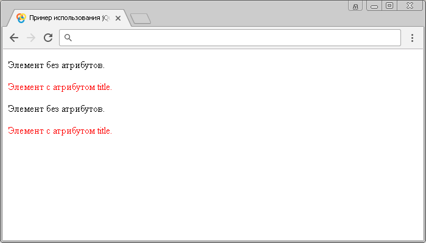

# Селектор атрибутов

**Селектор атрибутов** выбирает элементы, которые имеют указанный атрибут, с любым значением.

## Синтаксис

```js
$('[attribute]')
```

Добавлен в версии jQuery 1.0

## Пример

```html
<!DOCTYPE html>
<html>
  <head>
    <title>Использование jQuery селектора атрибутов</title>
    <script src="https://ajax.googleapis.com/ajax/libs/jquery/3.1.0/jquery.min.js"></script>
    <script>
      $(document).ready(function() {
        // выбираем все HTML элементы <p> с атрибутом title и устанавливаем цвет текста - красный
        $('[title]').css('color', 'red')
      })
    </script>
  </head>
  <body>
    <p>Элемент без атрибутов.</p>
    <p title="подсказка">Элемент с атрибутом title.</p>
    <p>Элемент без атрибутов.</p>
    <p title="подсказка">Элемент с атрибутом title.</p>
  </body>
</html>
```

В этом примере с использованием jQuery селектора атрибутов мы выбрали все элементы `<p>` в документе, которые содержат глобальный атрибут `title` и стилизовали их с использованием CSS свойства `color` (цвет текста)

Результат:



Пример использования jQuery селектора атрибутов.
