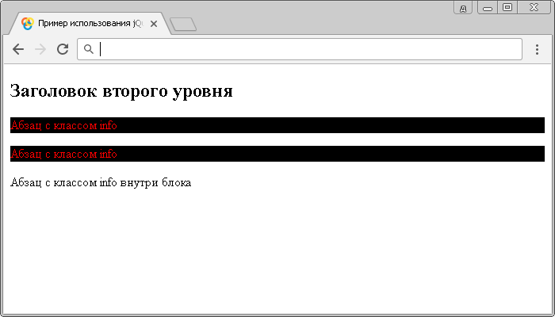

# Селектор следующих элементов

Селектор следующих элементов позволяет выбрать все элементы, которые следуют сразу же за элементом (смежные элементы), а также все элементы, которые находятся на одном уровне вложенности (сестринские элементы). Элементы должны иметь одного родителя.

## Синтаксис

```js
$('selector ~ selector')
```

Добавлен в версии jQuery 1.0

## Пример

```html
<!DOCTYPE html>
<html>
  <head>
    <title>Использование jQuery селектора следующих элементов</title>
    <script src="https://ajax.googleapis.com/ajax/libs/jquery/3.1.0/jquery.min.js"></script>
    <script>
      $(document).ready(function() {
        $('h2 ~ p').css('background-color', '#000') // выбирает все элементы <p> следующие после элемента <h2> внутри родительского элемента
        $('.main ~ .info').css('color', 'red') // выбирает все элементы с классом .info следующие после элемента с классом .main внутри родительского элемента
      })
    </script>
  </head>
  <body>
    <h2 class="main">Заголовок второго уровня</h2>
    <p class="info">Абзац с классом info</p>
    <p class="info">Абзац с классом info</p>
    <div>
      <p class="info">Абзац с классом info</p>
    </div>
  </body>
</html>
```

В этом примере с использованием селектора следующих элементов jQuery, мы выбрали все элементы `<p>` следующие после элемента `<h2>` внутри родительского элемента и все элементы с классом `.info` следующие после элемента с классом `.main` внутри родительского элемента (выбрали те же элементы, только в качестве селекторов указали не селекторы типа, а селекторы класса). В первом случае мы установили цвет заднего фона, а во втором цвет текста.

Результат нашего примера:



Пример использования jQuery селектора следующих элементов.
