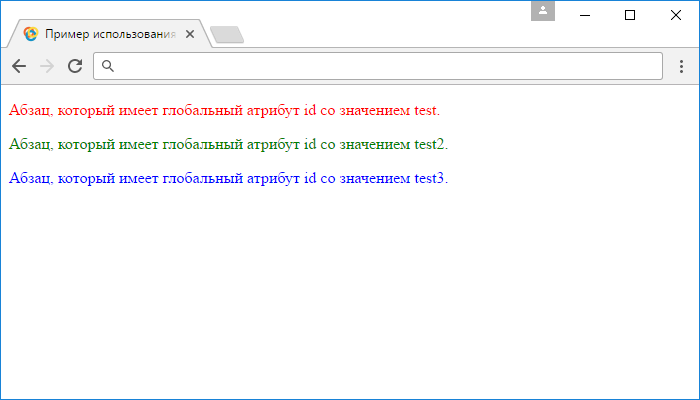

# Селектор id

Селектор `id` выбирает элемент, глобальный атрибут `id` которого, имеет указанное значение (элемент с определенным идентификатором).

Для поиска элемента с указанным идентификатором, библиотека jQuery использует функцию JavaScript `document.getElementById()`, вследствие чего, поиск идентификатора происходит быстро.

Следующие правила являются общими и их необходимо соблюдать при работе с `id` селекторами:

- значение идентификатора должно быть уникально на странице, размещение нескольких одноименных идентификаторов на странице считается ошибкой (выборка остановится на первом идентифакторе).
- все названия `id` селекторов должны начинаться с решётки (благодаря ей браузеры находят эти селекторы в таблице стилей). Решетка требуется только в названии селектора таблицы стилей (в значении глобального HTML атрибута `id` она не ставится).
- используйте только буквы алфавита (`A-Z`, `a-z`), числа, дефисы, знаки подчеркивания.
- название после решётки всегда должно начинаться с символа (неправильно: `#50cent`, `#-vottakvot`).
- учитывайте регистр при наименовании `id` селекторов, т. к. они к этому чувствительны (`#vottakvot` и `#VotTakVot` разные идентификаторы).

## Синтаксис:

```js
$('#id')
```

Добавлен в версии jQuery 1.0

## Пример

```html
<!DOCTYPE html>
<html>
  <head>
    <title>Использование jQuery селектора id</title>
    <script src="https://ajax.googleapis.com/ajax/libs/jquery/3.1.0/jquery.min.js"></script>
    <script>
      $(document).ready(function() {
        $('#test').css('color', 'red') // выбирает элемент с идентификатором test
        $('#test2').css('color', 'green') // выбирает элемент с идентификатором test2
        $('#test3').css('color', 'blue') // выбирает элемент с идентификатором test3
      })
    </script>
  </head>
  <body>
    <p id="test">
      Абзац, который имеет глобальный атрибут id со значением test.
    </p>
    <p id="test2">
      Абзац, который имеет глобальный атрибут id со значением test2.
    </p>
    <p id="test3">
      Абзац, который имеет глобальный атрибут id со значением test3.
    </p>
  </body>
</html>
```

Результат нашего примера:



Пример использования jQuery селектора `id`.
