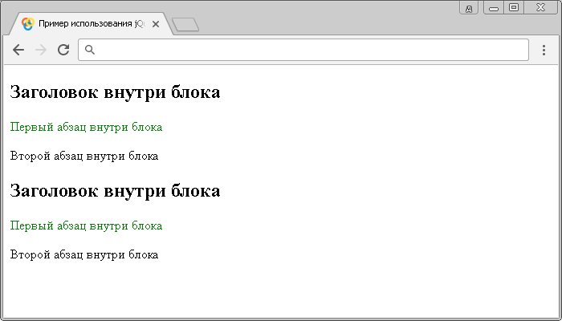

# :first-of-type

Селектор **`:first-of-type`** выбирает каждый элемент, который является первым дочерним элементом определенного типа внутри родительского элемента.

Отличие jQuery селектора `:first-of-type` от [`:first-child`](selector:first-child.md) заключается в том, что он выбирает первый дочерний элемент определенного типа, а не первый дочерний элемент этого типа.

Для того, чтобы выбрать элемент, который является первым элементом в документе, вы можете воспользоваться jQuery селектором [`:first`](selector:first.md).

## Синтаксис

```js
$('selector:first-of-type')
```

Добавлен в версии jQuery 1.9

## Пример

```html
<!DOCTYPE html>
<html>
  <head>
    <title>Использование jQuery селектора :first-of-type</title>
    <script src="https://ajax.googleapis.com/ajax/libs/jquery/3.1.0/jquery.min.js"></script>
    <script>
      $(document).ready(function() {
        $('p:first-of-type').css('color', 'green') // выбираем каждый элемент <p>, который является первым дочерним элементом определенного типа внутри родительского элемента.
      })
    </script>
  </head>
  <body>
    <div>
      <h2>Заголовок внутри блока</h2>
      <p>Первый абзац внутри блока</p>
      <p>Второй абзац внутри блока</p>
    </div>
    <div>
      <h2>Заголовок внутри блока</h2>
      <p>Первый абзац внутри блока</p>
      <p>Второй абзац внутри блока</p>
    </div>
  </body>
</html>
```

В этом примере с использованием селектора `:first-of-type` мы выбрали каждый элемент `<p>` (абзац), который является первым дочерним элементом определенного типа внутри родительского элемента. Обратите внимание, что если мы используем вместо jQuery селектора `:first-of-type` jQuery селектор `:first-child`, то он не выберет ниодного элемента `<p>`, так как эти элементы не являются первыми дочерними элементами своего родителя.

Результат:



Пример использования jQuery селектора `:first-of-type`
