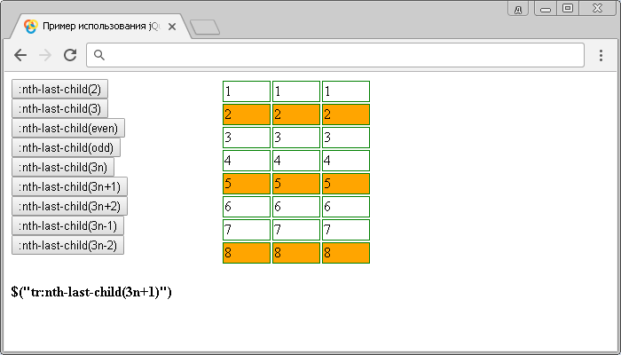

# :nth-last-child()

Селектор **`:nth-last-child`** позволяет выбрать каждый элемент, который является дочерним элементом своего родительского элемента считая от последнего дочернего элемента.

## Синтаксис

```js
$('selector:nth-last-child(номер | ключевое слово | формула)')
```

В качестве значения селектора `:nth-last-child()` может выступать не только порядковый номер дочерних элементов, которые необходимо стилизовать, но и ключевые слова, которые могут определять целую группу элементов. В качестве ключевого слова можно использовать два значения:

- `even` (четные элементы считая от последнего дочернего элемента)
- `odd` (нечетные элементы считая от последнего дочернего элемента)

Селектор `:nth-last-child()`, считая от последнего дочернего элемента позволяет выбрать не только чётные, нечетные, или дочерние элементы с определённым порядковым номером, но и дочерние элементы, заданные по элементарной математической формуле:

```js
$('td:nth-last-child(4n+2)')
```

Этот селектор означает, что каждая четвёртая ячейка таблицы (`<td>`) внутри строки, считая от последнего дочернего элемента, начиная со второй ячейки таблицы с конца, будет выбрана:

- `4n` – каждый четвертый элемент (считая от последнего дочернего элемента).
- `2` – с какого элемента начинать (считая от последнего дочернего элемента).

В формулах допускается использование значений со знаком вычитания, но в этом как правило нет необходимости:

```js
$('td:nth-last-child(4n-1)')
```

Этот селектор означает, что каждая четвёртая ячейка таблицы (`<td>`) внутри строки, считая от последнего дочернего элемента, начиная с третьей ячейки таблицы с конца (порядкового номера `-1` нет по объективным причинам, поэтому происходит сдвиг), будет выбрана:

- `4n` – каждый четвертый элемент (считая от последнего дочернего элемента).
- `-1` – с какого элемента начинать (считая от последнего дочернего элемента).

Добавлен в версии jQuery 1.9

## Пример

```html
<!DOCTYPE html>
<html>
  <head>
    <title>Использование jQuery селектора :nth-last-child</title>
    <style>
      CSS стили
    </style>
    <script src="https://ajax.googleapis.com/ajax/libs/jquery/3.1.0/jquery.min.js"></script>
    <script>
      $(document).ready(function(){
        $("button").click(function(){
          var str = $(this).text();
          $("tr").css("background", "#fff");
          $("tr" + str ).css("background", "orange");
          $(".info").text('$("tr'+str+'")');
      });
    </script>
  </head>
  <body>
    <div class="control">
      <button>:nth-last-child(2)</button>
      <button>:nth-last-child(3)</button>
      <button>:nth-last-child(even)</button>
      <button>:nth-last-child(odd)</button>
      <button>:nth-last-child(3n)</button>
      <button>:nth-last-child(3n+1)</button>
      <button>:nth-last-child(3n+2)</button>
      <button>:nth-last-child(3n-1)</button>
      <button>:nth-last-child(3n-2)</button>
      <div class="info"></div>
    </div>
    <table>
      <tr>
        <td>1</td>
        <td>1</td>
        <td>1</td>
      </tr>
      <tr>
        <td>2</td>
        <td>2</td>
        <td>2</td>
      </tr>
      <tr>
        <td>3</td>
        <td>3</td>
        <td>3</td>
      </tr>
      <tr>
        <td>4</td>
        <td>4</td>
        <td>4</td>
      </tr>
      <tr>
        <td>5</td>
        <td>5</td>
        <td>5</td>
      </tr>
      <tr>
        <td>6</td>
        <td>6</td>
        <td>6</td>
      </tr>
      <tr>
        <td>7</td>
        <td>7</td>
        <td>7</td>
      </tr>
      <tr>
        <td>8</td>
        <td>8</td>
        <td>8</td>
      </tr>
    </table>
  </body>
</html>
```

В этом интерактивном примере с использованием селектора `:nth-last-child` выбираем и стилизуем элементы `<tr>` (строка таблицы) в зависимости от их размещения (порядкового номера в документе).

Выбор строк таблицы по элементарной математической формуле:


