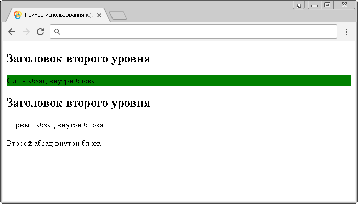

# :only-of-type

Селектор **`:only-of-type`** выбирает каждый элемент, который является единственным дочерним элементом определённого типа внутри своего родительского элемента (отсутствует элементы такого же типа внутри родительского элемента).

Главное отличие селектора `:only-child` от селектора `:only-of-type`, заключается в том, что при использовании `:only-of-type` учитывается количество элементов одного типа, а при использовании селектора `:only-child` количество элементов (независимо каких типов).

## Синтаксис

```js
$('selector:only-of-type')
```

Добавлен в версии jQuery 1.9

## Пример

```html
<!DOCTYPE html>
<html>
  <head>
    <title>Использование jQuery селектора :only-of-type</title>
    <script src="https://ajax.googleapis.com/ajax/libs/jquery/3.1.0/jquery.min.js"></script>
    <script>
      $(document).ready(function() {
        $('p:only-of-type').css('background-color', 'yellow') // выбираем все элементы <p> в документе, которые являются единственными дочерними элементами определённого типа внутри своего родительского элемента.
      })
    </script>
  </head>
  <body>
    <div>
      <h2>Заголовок второго уровня</h2>
      <p>Один абзац внутри блока</p>
    </div>
    <div>
      <h2>Заголовок второго уровня</h2>
      <p>Первый абзац внутри блока</p>
      <p>Второй абзац внутри блока</p>
    </div>
  </body>
</html>
```

В этом примере с использованием селектора `:only-of-type` мы выбираем все элементы `<p>` в документе, которые являются единственными дочерними элементами определённого типа внутри своего родительского элемента.

В нашем случае в роли родительских элементов выступают элементы `<div>`, и только первый из них содержит внутри себя единственный элемент `<p>` определённого типа, второй блок содержит два элемента такого типа.

Результат нашего примера:



Пример использования jQuery селектора `:only-of-type`.
