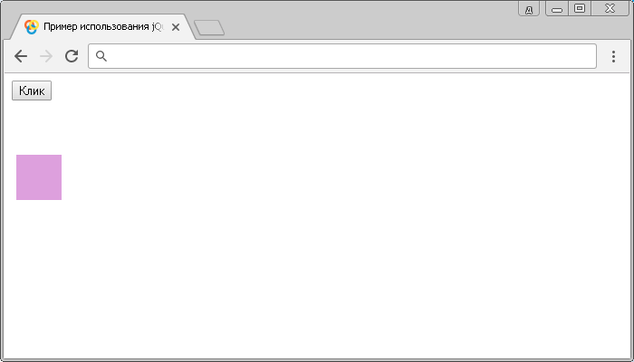

# :visible

Селектор **`:visible`** выбирает все элементы, которые видимы (занимают место в документе). Видимые элементы имеют ширину, или высоту больше нуля.

Этот селектор выбирает следующие элементы, так как они все еще занимают место в макете страницы:

- Элементы у которых установлено значение `hidden` у CSS свойства `visibility` (определяет, является ли элемент видимым).
- Элементы у которых установлено значение `0` у CSS свойства `opacity` (прозрачность).

Под скрытыми элементами подразумевается:

- Элементы у которых установлено значение `none` у CSS свойства `display`.
- Элементы формы, для которых установлено значение `hidden` в атрибуте `type`.
- В качестве значения ширины и высоты элемента задано нулевое значение.
- Родительский элемент скрыт, в этом случае дочерние элементы также не отображаются.

Селектор `:visible` является противоположностью селектора `:hidden` (каждый элемент, который был выбран одним селектором не будет выбран другим и наоборот).

## Синтаксис

```js
$(':visible')
```

Добавлен в версии jQuery 1.0

## Пример

```html
<!DOCTYPE html>
<html>
  <head>
    <title>Использование jQuery селектора :visible.</title>
    <script src="https://ajax.googleapis.com/ajax/libs/jquery/3.1.0/jquery.min.js"></script>
    <script>
      $(document).ready(function() {
        $('button').click(function() {
          // запускаем функцию при клике
          $('div:visible').css({
            // выбираем все div, которые занимают место в документе и стилизуем их
            border: '1px solid #000', // добавляем границу со всех сторон
            visibility: 'visible', // устанавливаем у всех элементов видимость по умолчанию
            opacity: '1' // устанавливаем прозрачность у всех элементов равной 1
          })
        })
      })
    </script>
  </head>
  <body>
    <button>Клик</button>
    <div
      style="width:50px;height:50px; margin:5px; background:plum; opacity:0"
    ></div>
    <div
      style="width:50px;height:50px; margin:5px; background:plum; display:none"
    ></div>
    <div style="width:50px;height:50px; margin:5px; background:plum"></div>
    <div
      style="width:50px;height:50px; margin:5px; background:plum; display:none"
    ></div>
    <div
      style="width:50px;height:50px; margin:5px; background:plum; visibility:hidden"
    ></div>
  </body>
</html>
```

В этом примере при нажатии на кнопку мы запускаем функцию, которая с использованием селектора `:visible` выбирает все видимые (занимают место в документе) элементы `<div>` и стилизует их.

Результат:



Пример использования jQuery селектора `:visible`.
