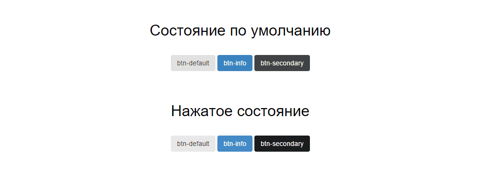

# Домашнее задание

В этой главе вы узнали о том, что такое переменные, какие значения в них можно хранить и как их использовать на практике. Кроме того, вы познакомились с примесями, позволяющими повторно использовать блоки кода. Самое время выполнить домашнее задание на эту тему.

## Постановка задачи

Необходимо разработать набор кнопок для сайта, используя все
полученные знания из этой главы.

### Техническое задание

Каждая кнопка имеет общий стиль, но при этом различается размерами и цветами.

Обязательным условием выполнения будет использование переменных для хранения цветов, размеров и прочих величин, которые могут поменяться на любой стадии развития проекта. А также примесей, которые будут менять размер и цвет кнопки в зависимости от передаваемых параметров.

Ниже приведены изображения кнопок, которые необходимо разработать.

**Состояние до нажатия и после**

**Размеры кнопок**

Для домашнего задания я заранее подготовил таблицу со всеми значениями переменных, которые могут понадобиться вам в работе.

**Цвет фона и шрифта**

| Свойство         | По умолчанию | Второй тип | Третий тип |
| ---------------- | ------------ | ---------- | ---------- |
| background       | #e0e0e0      | #3b83c0    | #404245    |
| color            | #333         | #fff       | #fff       |
| hover background | #e8e8e8      | #458ac6    | #1b1c1d    |
| hover color      | #333         | #fff       | #fff       |

**Размеры**

| Свойство    | Маленький | Стандартный | Большой   |
| ----------- | --------- | ----------- | --------- |
| font-size   | 10px      | 14px        | 18px      |
| line-height | 20px      | 20px        | 20px      |
| padding     | 2px 4px   | 6px 12px    | 10px 16px |

Не волнуйтесь, у вас все получится! Если у вас возникают какие-либо сложности, то посмотрите решение этого задания в архиве, который прилагается к этой книге.

> **Внимание**
>
> Решение этого домашнего задания будет предоставлено вместе с архивом
> примеров после завершения написания книги.
