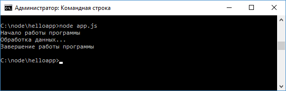
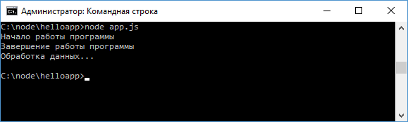
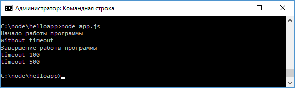

# Асинхронность в Node.js

**Асинхронность** представляет возможность одновременно выполнять сразу несколько задач. Асинхронность играет большую роль в Node.js.

Например, допустим в файле приложения `app.js` у нас расположен следующий код:

```js
function displaySync(data) {
  console.log(data)
}

console.log('Начало работы программы')

displaySync('Обработка данных...')

console.log('Завершение работы программы')
```

Это стандартный синхронный код, все вызовы здесь выполняются последовательно, что мы можем увидеть, если мы запустим приложение:



Для рассмотрения асинхронности изменим код файла `app.js` следующим образом:

```js
function display(data, callback) {
  // с помощью случайного числа определяем ошибку
  var randInt = Math.random() * (10 - 1) + 1
  var err =
    randInt > 5
      ? new Error('Ошибка выполнения. randInt больше 5')
      : null

  setTimeout(function () {
    callback(err, data)
  }, 0)
}

console.log('Начало работы программы')

display('Обработка данных...', function (err, data) {
  if (err) throw err
  console.log(data)
})

console.log('Завершение работы программы')
```

В начале также определяется функция `display`, но теперь кроме данных в качестве второго параметра она принимает функцию обратного вызова, которая и обрабатывает данные.

Эта функция `callback` принимает два параметра - информацию об ошибке и собственно данные. Это общая модель функций обратного вызова, которые передаются в асинхронные методы - первым идет параметр, представляющий ошибку, а второй - данные.

Для имитации ошибки используется случайное число: если оно больше `5`, то создаем объект ошибки - объект `Error`, иначе же он равен `null`.

И последний важный момент - выполнение функции обратного вызова в функции `setTimeout()`. Это глобальная функция, которая принимает в качестве первого параметра функцию обратного вызова, а в качестве второго - промежуток, через который функция обратного вызова будет выполняться. Для нашей задачи вполне подойдет промежуток в `0` миллисекунд.

При вызове функции `display` в нее передается функция, которая в случае отсутствия ошибок просто выводит данные на консоль:

```js
display('Обработка данных...', function (err, data) {
  if (err) throw err
  console.log(data)
})
```

Теперь если мы запустим приложение, то увидим, следующую картину:



Несмотря на то, что в `setTimeout` передается промежуток `0`, фактическое выполнение функции `display` завершается после всех остальных функций, которые определены в программе. В итоге выполнение на функции `display` не блокируется, а идет дальше. И это особенно актуально, если в приложении идет какая-либо функция ввода-вывода, например, чтения файла или взаимодействия с базой данных, выполнение которой может занять продолжительное время. То общее выполнение приложение не блокируется, а идет дальше.

Почему так происходит? Потому что все колбеки или функции обратного вызова в асинхронных функциях (в качестве таковой здесь используется функция `setTimeout`) помещаются в специальную очередь, и начинают выполняться после того, как все остальные синхронные вызовы в приложении завершат свою работу. Собственно поэтому выполнение колбека из функции `setTimeout` в примере выше происходит после выполнения вызова `console.log("Завершение работы программы");`. И стоит подчеркнуть, что в очередь колбеков переходит не функция, которая передается в `display`, а функция, которая передается в `setTimeout`.

Рассмотрим пример с двумя асинхронными вызовами:

```js
function displaySync(callback) {
  callback()
}

console.log('Начало работы программы')

setTimeout(function () {
  console.log('timeout 500')
}, 500)

setTimeout(function () {
  console.log('timeout 100')
}, 100)

displaySync(function () {
  console.log('without timeout')
})
console.log('Завершение работы программы')
```

Результат выполнения:



Несмотря на то, что в функцию `display` передается колбек, но эта функция с колбеком будет выполняться синхронно.

А колбеки из функций `setTimeout` будут выполняться только после всех остальных вызовов приложения.
