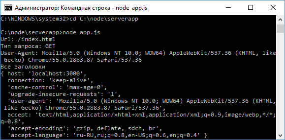
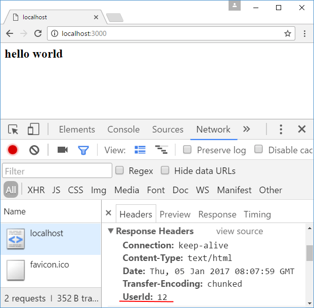
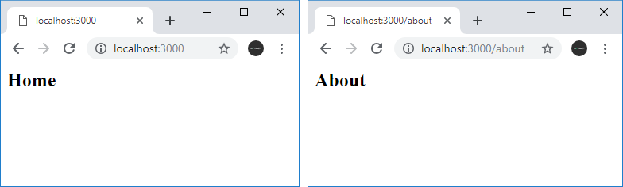

# Создание сервера

Для работы с сервером и протоколом http в Node.js используется модуль [http](https://nodejs.org/api/http.html).

Чтобы создать сервер, следует вызвать метод `http.createServer()`:

```js
const http = require('http')
http.createServer().listen(3000)
```

Метод `createServer()` возвращает объект `http.Server`. Но чтобы сервер мог прослушивать и обрабатывать входящие подключения, у объекта сервера необходимо вызвать метод `listen()`, в который в качестве параметра передается номер порта, по которому запускается сервер.

Для обработки подключений в метод `createServer` можно передать специальную функцию:

```js
const http = require('http')

http
  .createServer(function (request, response) {
    response.end('Hello world!')
  })
  .listen(3000)
```

Эта функция принимает два параметра:

- `request`: хранит информацию о запросе
- `response`: управляет отправкой ответа

## Request

Параметр `request` позволяет получить информацию о запросе и представляет объект `http.IncomingMessage`. Отметим некоторые основные свойства этого объекта:

- `headers`: возвращает заголовки запроса
- `method`: тип запроса (`GET`, `POST`, `DELETE`, `PUT`)
- `url`: представляет запрошенный адрес

Например, определим следующий файл `app.js`:

```js
var http = require('http')

http
  .createServer(function (request, response) {
    console.log('Url: ' + request.url)
    console.log('Тип запроса: ' + request.method)
    console.log(
      'User-Agent: ' + request.headers['user-agent']
    )
    console.log('Все заголовки')
    console.log(request.headers)

    response.end()
  })
  .listen(3000)
```

Запустим его и обратимся в браузере по адресу [http://localhost:3000/index.html](http://localhost:3000/index.html):



## Response

Параметр `response` управляет отправкой ответа и представляет объект `http.ServerResponse`. Среди его функциональности можно выделить следующие методы:

- `statusCode`: устанавливает статусный код ответа
- `statusMessage`: устанавливает сообщение, отправляемое вместе со статусным кодом
- `setHeader(name, value)`: добавляет в ответ один заголовок
- `write`: пишет в поток ответа некоторое содержимое
- `writeHead`: добавляет в ответ статусный код и набор заголовков
- `end`: сигнализирует серверу, что заголовки и тело ответа установлены, в итоге ответ отсылается клиента. Данный метод должен вызываться в каждом запросе.

Например, изменим файл `app.js` следующим образом:

```js
const http = require('http')

http
  .createServer(function (request, response) {
    response.setHeader('UserId', 12)
    response.setHeader(
      'Content-Type',
      'text/html; charset=utf-8;'
    )
    response.write('<h2>hello world</h2>')
    response.end()
  })
  .listen(3000)
```

Запустим файл и обратимся в браузере к приложению:



Если предстоит отправить довольно большой ответ, то мы можем несколько раз вызвать метод `write()`, последовательно оправляя в исходящий поток каждый кусочек информации. Например, отправим код более менее полноценной веб-страницы:

```js
const http = require('http')

http
  .createServer(function (request, response) {
    response.setHeader('Content-Type', 'text/html')
    response.write('<!DOCTYPE html>')
    response.write('<html>')
    response.write('<head>')
    response.write('<title>Hello Node.js</title>')
    response.write('<meta charset="utf-8" />')
    response.write('</head>')
    response.write('<body><h2>Привет миг</h2></body>')
    response.write('</html>')
    response.end()
  })
  .listen(3000)
```

## Маршрутизация

По умолчанию Node.js не имеет встроенной системы маршрутизации. Обычно она реализуется с помощью специальных фреймворках типа [Express](../expressjs4/installing.md), о котором речь пойдет в следующей главе. Однако если необходимо разграничить простейшую обработку пары-тройки маршрутов, то вполне можно использовать для этого свойство `url` объекта `Request`. Например:

```js
const http = require('http')

http
  .createServer(function (request, response) {
    response.setHeader(
      'Content-Type',
      'text/html; charset=utf-8;'
    )

    if (request.url === '/home' || request.url === '/') {
      response.write('<h2>Home</h2>')
    } else if (request.url == '/about') {
      response.write('<h2>About</h2>')
    } else if (request.url == '/contact') {
      response.write('<h2>Contacts</h2>')
    } else {
      response.write('<h2>Not found</h2>')
    }
    response.end()
  })
  .listen(3000)
```

В данном случае обрабатываются три маршрута. Если идет обрашение к корню сайта или по адресу `localhost:3000/home`, то пользователю выводится строка `Home`. Ели обращение идет по адресу `localhost:3000/about`, то пользователю в браузере отображается строка `About` и так далее. Если запрошенный адрес не соответствует ни одному маршруту, то выводится заговлок `Not Found`.



Однако опять же отмечу, что рамках специальных фреймворков, которые работают поверх Node.js, например, Express, есть более удобные способы для обработки маршрутов, которые нередко и используются.

## Переадресация

Переадресация предполагает отправку статусного кода `301` (постоянная переадресация) или `302` (временная переадресация) и заголовка `Location`, который указывает на новый адрес. Например, выполним переадресацию с адреса `localhost:3000/` на адрес `localhost:3000/newpage`

```js
const http = require('http')

http
  .createServer(function (request, response) {
    response.setHeader(
      'Content-Type',
      'text/html; charset=utf-8;'
    )

    if (request.url === '/') {
      response.statusCode = 302 // временная переадресация
      // на адрес localhost:3000/newpage
      response.setHeader('Location', '/newpage')
    } else if (request.url == '/newpage') {
      response.write('New address')
    } else {
      response.write('Not Found')
      response.statusCode = 404 // адрес не найден
    }
    response.end()
  })
  .listen(3000)
```
