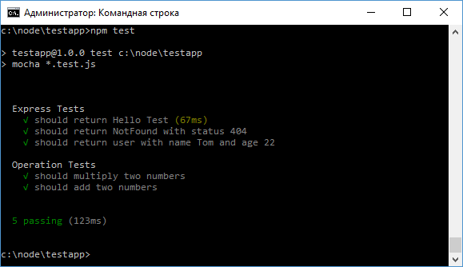

# Организация тестов и метод describe

В процессе разработки у нас может быть множество модулей, и для каждого может быть определено несколько тестов. С помощью метода `describe()`, который определен в `mocha.js`, можно оформить тесты в связанные группы. Например, тесты по одному модулю будут составлять одну группу, а тесты другого модуля будут оформлять соответственно другую группу. Разбиение на группы позволит легко идентифицировать, для какого модуля или группы не прошел тест, особенно если тестов очень много.

Например, пусть в проекте будет модуль `operations.js`:

```js
module.exports.multiply = function (x, y) {
  return x * y
}
module.exports.add = function (x, y) {
  return x + y
}
```

Для этого модуля определим файл тестов `operations.test.js`:

```js
var assert = require('assert')
var operations = require('./operations')

describe('Operation Tests', function () {
  it('should multiply two numbers', function () {
    var expected = 15
    var result = operations.multiply(3, 5)
    assert.equal(result, expected)
  })
  it('should add two numbers', function () {
    var expected = 16
    var result = operations.add(9, 7)
    assert.equal(result, expected)
  })
})
```

В метод `describe()` в качестве первого параметра передается описание тестов, а в качестве второго - функция, которая содержит тесты.

Также пусть в проекте будет файл `app.js`:

```js
const express = require('express')
var app = express()

app.get('/', function (request, response) {
  response.send('Hello Test')
})

app.get('/error', function (request, response) {
  response.status(404).send('NotFound')
})

app.get('/user', function (request, response) {
  response.send({ name: 'Tom', age: 22 })
})

app.listen(3000)

module.exports.app = app
```

Для него определим файл тестов `app.test.js`:

```js
const request = require('supertest')
const assert = require('assert')

var app = require('./app').app

describe('Express Tests', function () {
  it('should return Hello Test', function (done) {
    request(app).get('/').expect('Hello Test').end(done)
  })

  it('should return NotFound with status 404', function (done) {
    request(app)
      .get('/error')
      .expect(404)
      .expect('NotFound')
      .end(done)
  })

  it('should return user with name Tom and age 22', function (done) {
    request(app)
      .get('/user')
      .expect(function (response) {
        assert.deepEqual(response.body, {
          name: 'Tom',
          age: 22,
        })
      })
      .end(done)
  })
})
```

Здесь метод `describe` оформляет вторую группу.

Запустим тесты:


