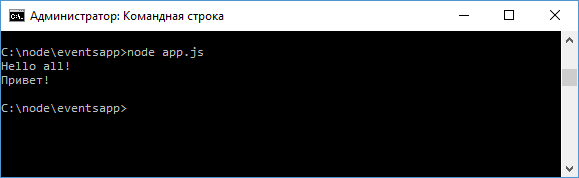
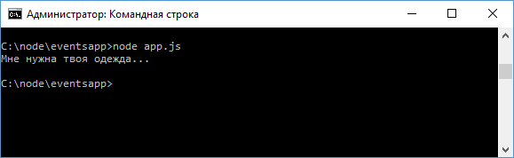

# События

Подавляющее большинство функционала Node.js применяет асинхронную событийную архитектуру, которая использует специальные объекты - эмиттеры для генерации различных событий, которые обрабатываются специальными функциями - обработчиками или слушателями событий. Все объекты, которые генерируют события, представляют экземпляры класса `EventEmitter`.

С помощью функции `eventEmitter.on()` к определенному событию по имени цепляется функция обработчика. Причем для одного события можно указать множество обработчиков. Когда объект `EventEmitter` генерирует событие, происходит выполнение всех этих обработчиков.

Рассмотрим применение объекта `EventEmitter` и событий. Для этого определим следующий файл `app.js`:

```js
const Emitter = require('events')
let emitter = new Emitter()
let eventName = 'greet'
emitter.on(eventName, function () {
  console.log('Hello all!')
})

emitter.on(eventName, function () {
  console.log('Привет!')
})

emitter.emit(eventName)
```

Весь необходимый функционал сосредоточен в модуле `events`, который необходимо подключить. С помощью функции `on()` связываем событие, которое передается в качестве первого параметра, с некоторой функцией, которая передается в качестве второго параметра. В данном случае событие называется `greet`.

Для генерации события и вызова связанных с ним обработчиков выполняется функция `emitter.emit()`, в которое передается название события.

И при запуске приложения будут вызваны все обработчики:



## Передача параметров событию

При вызове события в качестве второго параметра в функцию `emit` можно передавать некоторый объект, который передается в функцию обработчика события:

```js
const Emitter = require('events')
let emitter = new Emitter()
let eventName = 'greet'
emitter.on(eventName, function (data) {
  console.log(data)
})

emitter.emit(eventName, 'Привет пир!')
```

## Наследование от EventEmitter

В приложении мы можем оперировать сложными объектами, для которых также можно определять события, но для этого их надо связать с объектом `EventEmitter`. Например:

```js
const util = require('util')
const EventEmitter = require('events')

function User() {}
util.inherits(User, EventEmitter)

let eventName = 'greet'
User.prototype.sayHi = function (data) {
  this.emit(eventName, data)
}
let user = new User()
// добавляем к объекту user обработку события "greet"
user.on(eventName, function (data) {
  console.log(data)
})

user.sayHi('Мне нужна твоя одежда...')
```

Здесь определена функция конструктора `User`, которая представляет пользователя. Для прототипа `User` определяется метод `sayHi`, в котором генерируется событие `greet`.

Но чтобы связать объект `User` с `EventEmitter`, надо вызвать функцию `util.inherits(User, EventEmitter);`. Она позволяет унаследовать классу `User` функционал от `EventEmitter`. Благодаря этому мы можем через метод `on()` добавить к событию объекта `user` какой-нибудь обработчик, который будет вызван при выполнении метода `user.sayHi()`.



С помощью возможностей ES6 мы можем упростить выше пример:

```js
const EventEmitter = require('events')

let eventName = 'greet'

class User extends EventEmitter {
  sayHi(data) {
    this.emit(eventName, data)
  }
}

let user = new User()
// добавляем к объекту user обработку события "greet"
user.on(eventName, function (data) {
  console.log(data)
})

user.sayHi('Мне нужна твоя одежда...')
```

Результат будет тот же, но теперь не нужно использовать функцию `util.inherits`.
