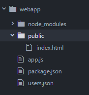
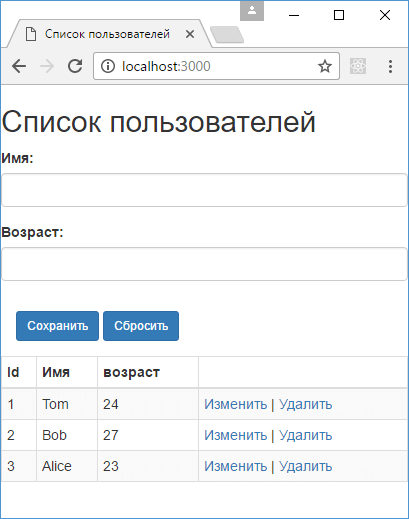

# Создание API

Используя Express и Node.js, мы можем реализовать полноценный API в стиле REST для взаимодействия с пользователем. Архитектура REST предполагает применение следующих методов или типов запросов HTTP для взаимодействия с сервером:

- `GET`
- `POST`
- `PUT`
- `DELETE`

Зачастую REST-стиль особенно удобен при создании всякого рода Single Page Application, которые нередко используют специальные javascript-фреймворки типа Angular, React или Knockout.

Рассмотрим, как создать свой API. Для нового проекта создадим новую папку, которая пусть будет называться `webapp`. Сразу определим в проекте файл `package.json`:

```json
{
  "name": "webapp",
  "version": "1.0.0",
  "dependencies": {
    "body-parser": "^1.16.0",
    "express": "^4.14.0"
  }
}
```

В проекте нам понадобятся `express` и `body-parser` для парсинга полученных данных.

Далее перейдем к этому каталогу в командной строке/терминале и для добавления всех нужных пакетов выполним команду:

```
npm install
```

В данном случае мы создадим экспериментальный проект, который будет хранить данные в файле json и который призван просто показать создание API в Node.js в стиле REST. А пока добавим в папку проекта новый файл `users.json` со следующим содержанием:

```json
[
  {
    "id": 1,
    "name": "Tom",
    "age": 24
  },
  {
    "id": 2,
    "name": "Bob",
    "age": 27
  },
  {
    "id": 3,
    "name": "Alice",
    "age": "23"
  }
]
```

Для чтения и записи в этот файл мы будем использовать встроенный модуль `fs`. Для обработки запросов определим в проекте следующий файл `app.js`:

```js
var express = require('express')
var bodyParser = require('body-parser')
var fs = require('fs')

var app = express()
var jsonParser = bodyParser.json()

app.use(express.static(__dirname + '/public'))
// получение списка данных
app.get('/api/users', function (req, res) {
  var content = fs.readFileSync('users.json', 'utf8')
  var users = JSON.parse(content)
  res.send(users)
})
// получение одного пользователя по id
app.get('/api/users/:id', function (req, res) {
  var id = req.params.id // получаем id
  var content = fs.readFileSync('users.json', 'utf8')
  var users = JSON.parse(content)
  var user = null
  // находим в массиве пользователя по id
  for (var i = 0; i < users.length; i++) {
    if (users[i].id == id) {
      user = users[i]
      break
    }
  }
  // отправляем пользователя
  if (user) {
    res.send(user)
  } else {
    res.status(404).send()
  }
})
// получение отправленных данных
app.post('/api/users', jsonParser, function (req, res) {
  if (!req.body) return res.sendStatus(400)

  var userName = req.body.name
  var userAge = req.body.age
  var user = { name: userName, age: userAge }

  var data = fs.readFileSync('users.json', 'utf8')
  var users = JSON.parse(data)

  // находим максимальный id
  var id = Math.max.apply(
    Math,
    users.map(function (o) {
      return o.id
    })
  )
  // увеличиваем его на единицу
  user.id = id + 1
  // добавляем пользователя в массив
  users.push(user)
  var data = JSON.stringify(users)
  // перезаписываем файл с новыми данными
  fs.writeFileSync('users.json', data)
  res.send(user)
})
// удаление пользователя по id
app.delete('/api/users/:id', function (req, res) {
  var id = req.params.id
  var data = fs.readFileSync('users.json', 'utf8')
  var users = JSON.parse(data)
  var index = -1
  // находим индекс пользователя в массиве
  for (var i = 0; i < users.length; i++) {
    if (users[i].id == id) {
      index = i
      break
    }
  }
  if (index > -1) {
    // удаляем пользователя из массива по индексу
    var user = users.splice(index, 1)[0]
    var data = JSON.stringify(users)
    fs.writeFileSync('users.json', data)
    // отправляем удаленного пользователя
    res.send(user)
  } else {
    res.status(404).send()
  }
})
// изменение пользователя
app.put('/api/users', jsonParser, function (req, res) {
  if (!req.body) return res.sendStatus(400)

  var userId = req.body.id
  var userName = req.body.name
  var userAge = req.body.age

  var data = fs.readFileSync('users.json', 'utf8')
  var users = JSON.parse(data)
  var user
  for (var i = 0; i < users.length; i++) {
    if (users[i].id == userId) {
      user = users[i]
      break
    }
  }
  // изменяем данные у пользователя
  if (user) {
    user.age = userAge
    user.name = userName
    var data = JSON.stringify(users)
    fs.writeFileSync('users.json', data)
    res.send(user)
  } else {
    res.status(404).send(user)
  }
})

app.listen(3000, function () {
  console.log('Сервер ожидает подключения...')
})
```

Для обработки запросов определено пять методов для каждого типа запросов: `app.get()`/`app.post()`/`app.delete()`/`app.put()`

Когда приложение получает запрос типа GET по адресу `api/users`, то срабатывает следующий метод:

```js
app.get('/api/users', function (req, res) {
  var content = fs.readFileSync('users.json', 'utf8')
  var users = JSON.parse(content)
  res.send(users)
})
```

В качестве результата обработки мы должны отправить массив пользователей, которые считываем из файла. Для упрощения кода приложения в рамках данного экспериментального проекта для чтения/записи файла применяются синхронные методы `fs.readFileSync()`/`fs.writeFileSync()`. Но в реальности, как правило, работа с данными будет идти через базу данных, а далее мы все это рассмотрим на примере MongoDB.

И чтобы получить данные из файла с помощью метода `fs.readFileSync()` считываем данные в строку, которую парсим в массив объектов с помощью функции `JSON.parse()`. И в конце полученные данные отправляем клиенту методом `res.send()`.

Аналогично работает другой метод `app.get()`, который срабатывает, когда в адресе указан `id` пользователя:

```js
app.get('/api/users/:id', function (req, res) {
  var id = req.params.id // получаем id
  var content = fs.readFileSync('users.json', 'utf8')
  var users = JSON.parse(content)
  var user = null
  // находим в массиве пользователя по id
  for (var i = 0; i < users.length; i++) {
    if (users[i].id == id) {
      user = users[i]
      break
    }
  }
  // отправляем пользователя
  if (user) {
    res.send(user)
  } else {
    res.status(404).send()
  }
})
```

Единственное, что в этом случае нам надо найти нужного пользователя по `id` в массиве, а если он не был найден, возвратить статусный код `404`: `res.status(404).send()`.

При получении запроса методом `POST` нам надо применить парсер `jsonParser` для извлечения данных из запроса:

```js
// получение отправленных данных
app.post('/api/users', jsonParser, function (req, res) {
  if (!req.body) return res.sendStatus(400)

  var userName = req.body.name
  var userAge = req.body.age
  var user = { name: userName, age: userAge }

  var data = fs.readFileSync('users.json', 'utf8')
  var users = JSON.parse(data)

  // находим максимальный id
  var id = Math.max.apply(
    Math,
    users.map(function (o) {
      return o.id
    })
  )
  // увеличиваем его на единицу
  user.id = id + 1
  // добавляем пользователя в массив
  users.push(user)
  var data = JSON.stringify(users)
  // перезаписываем файл с новыми данными
  fs.writeFileSync('users.json', data)
  res.send(user)
})
```

После получения данных нам надо создать новый объект и добавить его в массив объектов. Для этого считываем данные из файла, добавляем в массив новый объект и перезаписываем файл с обновленными данными.

При удалении производим похожие действия, только теперь извлекаем из массива удаляемый объект и опять же перезаписываем файл:

```js
app.delete('/api/users/:id', function (req, res) {
  var id = req.params.id
  var data = fs.readFileSync('users.json', 'utf8')
  var users = JSON.parse(data)
  var index = -1
  // находим индекс пользователя в массиве
  for (var i = 0; i < users.length; i++) {
    if (users[i].id == id) {
      index = i
      break
    }
  }
  if (index > -1) {
    // удаляем пользователя из массива по индексу
    var user = users.splice(index, 1)[0]
    var data = JSON.stringify(users)
    fs.writeFileSync('users.json', data)
    // отправляем удаленного пользователя
    res.send(user)
  } else {
    res.status(404).send()
  }
})
```

Если объект не найден, возвращаем статусный код `404`.

Если приложению приходит PUT-запрос, то он обрабатывается методом `app.put()`, в котором с помощью `jsonParser` получаем измененные данные:

```js
app.put('/api/users', jsonParser, function (req, res) {
  if (!req.body) return res.sendStatus(400)

  var userId = req.body.id
  var userName = req.body.name
  var userAge = req.body.age

  var data = fs.readFileSync('users.json', 'utf8')
  var users = JSON.parse(data)
  var user
  for (var i = 0; i < users.length; i++) {
    if (users[i].id == userId) {
      user = users[i]
      break
    }
  }
  if (user) {
    user.age = userAge
    user.name = userName
    var data = JSON.stringify(users)
    fs.writeFileSync('users.json', data)
    res.send(user)
  } else {
    res.status(404).send(user)
  }
})
```

Здесь также для поиска изменяемого объекта считываем данные из файла, находим изменяемого пользователя по `id`, изменяем у него свойства и сохраняем обновленные данные в файл.

Таким образом, мы определили простейший API. Теперь добавим код клиента. Итак, как установлено в коде, Express для хранения статических файлов использует папку `public`, поэтому создадим в проекте подобную папку. В этой папке определим новый файл `index.html`, который будет выполнять роль клиента. В итоге весь проект будет выглядеть следующим образом:



Далее определим в файле `index.html` следующий код:

```html
<!DOCTYPE html>
<html>
  <head>
    <meta charset="utf-8" />
    <meta name="viewport" content="width=device-width" />
    <title>Список пользователей</title>
    <link
      href="https://maxcdn.bootstrapcdn.com/bootstrap/3.3.7/css/bootstrap.min.css"
      rel="stylesheet"
    />
    <script src="https://code.jquery.com/jquery-2.2.4.min.js"></script>
  </head>
  <body>
    <h2>Список пользователей</h2>
    <form name="userForm">
      <input type="hidden" name="id" value="0" />
      <div class="form-group">
        <label for="name">Имя:</label>
        <input class="form-control" name="name" />
      </div>
      <div class="form-group">
        <label for="age">Возраст:</label>
        <input class="form-control" name="age" />
      </div>
      <div class="panel-body">
        <button
          type="submit"
          class="btn btn-sm btn-primary"
        >
          Сохранить
        </button>
        <a id="reset" class="btn btn-sm btn-primary"
          >Сбросить</a
        >
      </div>
    </form>
    <table
      class="table table-condensed table-striped table-bordered"
    >
      <thead>
        <tr>
          <th>Id</th>
          <th>Имя</th>
          <th>возраст</th>
          <th></th>
        </tr>
      </thead>
      <tbody></tbody>
    </table>

    <script>
      // Получение всех пользователей
      function GetUsers() {
        $.ajax({
          url: '/api/users',
          type: 'GET',
          contentType: 'application/json',
          success: function (users) {
            var rows = ''
            $.each(users, function (index, user) {
              // добавляем полученные элементы в таблицу
              rows += row(user)
            })
            $('table tbody').append(rows)
          },
        })
      }
      // Получение одного пользователя
      function GetUser(id) {
        $.ajax({
          url: '/api/users/' + id,
          type: 'GET',
          contentType: 'application/json',
          success: function (user) {
            var form = document.forms['userForm']
            form.elements['id'].value = user.id
            form.elements['name'].value = user.name
            form.elements['age'].value = user.age
          },
        })
      }
      // Добавление пользователя
      function CreateUser(userName, userAge) {
        $.ajax({
          url: 'api/users',
          contentType: 'application/json',
          method: 'POST',
          data: JSON.stringify({
            name: userName,
            age: userAge,
          }),
          success: function (user) {
            reset()
            $('table tbody').append(row(user))
          },
        })
      }
      // Изменение пользователя
      function EditUser(userId, userName, userAge) {
        $.ajax({
          url: 'api/users',
          contentType: 'application/json',
          method: 'PUT',
          data: JSON.stringify({
            id: userId,
            name: userName,
            age: userAge,
          }),
          success: function (user) {
            reset()
            $(
              "tr[data-rowid='" + user.id + "']"
            ).replaceWith(row(user))
          },
        })
      }

      // сброс формы
      function reset() {
        var form = document.forms['userForm']
        form.reset()
        form.elements['id'].value = 0
      }

      // Удаление пользователя
      function DeleteUser(id) {
        $.ajax({
          url: 'api/users/' + id,
          contentType: 'application/json',
          method: 'DELETE',
          success: function (user) {
            console.log(user)
            $("tr[data-rowid='" + user.id + "']").remove()
          },
        })
      }
      // создание строки для таблицы
      var row = function (user) {
        return (
          "<tr data-rowid='" +
          user.id +
          "'><td>" +
          user.id +
          '</td>' +
          '<td>' +
          user.name +
          '</td> <td>' +
          user.age +
          '</td>' +
          "<td><a class='editLink' data-id='" +
          user.id +
          "'>Изменить</a> | " +
          "<a class='removeLink' data-id='" +
          user.id +
          "'>Удалить</a></td></tr>"
        )
      }
      // сброс значений формы
      $('#reset').click(function (e) {
        e.preventDefault()
        reset()
      })

      // отправка формы
      $('form').submit(function (e) {
        e.preventDefault()
        var id = this.elements['id'].value
        var name = this.elements['name'].value
        var age = this.elements['age'].value
        if (id == 0) CreateUser(name, age)
        else EditUser(id, name, age)
      })

      // нажимаем на ссылку Изменить
      $('body').on('click', '.editLink', function () {
        var id = $(this).data('id')
        GetUser(id)
      })
      // нажимаем на ссылку Удалить
      $('body').on('click', '.removeLink', function () {
        var id = $(this).data('id')
        DeleteUser(id)
      })

      // загрузка пользователей
      GetUsers()
    </script>
  </body>
</html>
```

Основная логика здесь заключена в коде javascript. Для упрощения взаимодействия с сервером здесь применяется библиотека jquery. При загрузке страницы в браузере получаем все объекты из БД с помощью функции `GetUsers`:

```js
function GetUsers() {
  $.ajax({
    url: '/api/users',
    type: 'GET',
    contentType: 'application/json',
    success: function (users) {
      var rows = ''
      $.each(users, function (index, user) {
        // добавляем полученные элементы в таблицу
        rows += row(user)
      })
      $('table tbody').append(rows)
    },
  })
}
```

Для добавления строк в таблицу используется функция `row()`, которая возвращает строку. В этой строке будут определены ссылки для изменения и удаления пользователя.

Ссылка для изменения пользователя с помощью функции `GetUser()` получает с сервера выделенного пользователя:

```js
function GetUser(id) {
  $.ajax({
    url: '/api/users/' + id,
    type: 'GET',
    contentType: 'application/json',
    success: function (user) {
      var form = document.forms['userForm']
      form.elements['id'].value = user.id
      form.elements['name'].value = user.name
      form.elements['age'].value = user.age
    },
  })
}
```

И выделенный пользователь добавляется в форму над таблицей. Эта же форма применяется и для добавления объекта. С помощью скрытого поля, которое хранит `id` пользователя, мы можем узнать, какое действие выполняется - добавление или редактирование. Если `id` равен `0`, то выполняется функция `CreateUser`, которая отправляет данные в POST-запросе:

```js
function CreateUser(userName, userAge) {
  $.ajax({
    url: 'api/users',
    contentType: 'application/json',
    method: 'POST',
    data: JSON.stringify({
      name: userName,
      age: userAge,
    }),
    success: function (user) {
      reset()
      $('table tbody').append(row(user))
    },
  })
}
```

Если же ранее пользователь был загружен на форму, и в скрытом поле сохранился его `id`, то выполняется функция `EditUser`, которая отправляет PUT-запрос:

```js
function EditUser(userId, userName, userAge) {
  $.ajax({
    url: 'api/users',
    contentType: 'application/json',
    method: 'PUT',
    data: JSON.stringify({
      id: userId,
      name: userName,
      age: userAge,
    }),
    success: function (user) {
      reset()
      $("tr[data-rowid='" + user.id + "']").replaceWith(
        row(user)
      )
    },
  })
}
```

Запустим приложение, обратимся в браузере по адресу `http://localhost:3000` и мы сможем управлять пользователями, которые хранятся в файле json:


