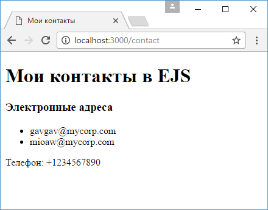
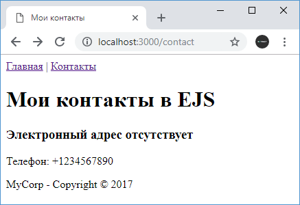

# Движок EJS

В качестве альтернативы Handlebars вкратце рассмотрим применение другого движка представлений - [EJS](https://www.npmjs.com/package/ejs). Этот движок использует синтаксис, который во многом был заимствован из движка представлений Web Forms на платформе ASP.NET, который разрабатывался в компании Microsoft.

Вначале добавим пакеты `ejs` в проект с помощью команды:

```
npm install ejs --save
```

Определим в файле `app.js` следующий код:

```js
const express = require('express')

const app = express()

app.set('view engine', 'ejs')

app.use('/contact', function (request, response) {
  response.render('contact', {
    title: 'Мои контакты',
    emailsVisible: true,
    emails: ['gavgav@mycorp.com', 'mioaw@mycorp.com'],
    phone: '+1234567890',
  })
})
app.use('/', function (request, response) {
  response.send('Главная страница')
})
app.listen(3000)
```

По факту здесь определен тот же код, что и в одной из предыдущих тем, только теперь устанавливается движок `ejs`:

```js
app.set('view engine', 'ejs')
```

Далее добавим в папку `views` в папке проекта новый файл `contact.ejs` (представления в EJS по умолчанию имеют расширение `.ejs`):

```html
<!DOCTYPE html>
<html>
<head>
    <title><%=title %></title>
    <meta charset="utf-8" />
</head>
<body>

    <h1><%=title %> в EJS</h1>

    <% if(emailsVisible) {%>
        <h3>Электронные адреса</h3>
        <ul>
            <% for(var i=0; i<emails.length;i++) {%>
                <li><%=emails[i] %></li>
            <%} %>
        </ul>
    <% }else  %>
    <p>Телефон: <%=phone %></p>
</body>
<html>
```

Для работы с моделью представления используются выражения javascript, которые определяются с помощью тега `<% выражение %>`. Каждый блок кода - условная конструкция, цикл должны как и в javascript помещаться в фигурные скобки, соответственно для каждого блока определяется открывающая фигурная скобка и закрывающаяся:

```
<% for(var i=0; i<emails.length;i++)  %>
```

При обращении по адресу `/contact` приложение сгенерирует веб-страницу:



## Частичные представления

EJS позволяет вставлять код одних представлений в другие с помощью функции `include`. Например, определим в папке `views` каталог `partials`, в который добавим два файла. Первый файл - `menu.ejs` будет иметь следующий код:

```html
<nav>
  <a href="/">Главная</a> | <a href="/contact">Контакты</a>
</nav>
```

И второй файл - `footer.ejs` будет предствлять футер:

```html
<footer><p>MyCorp - Copyright © 2017</p></footer>
```

Теперь подключим эти файлы в `contact.ejs`:

```html
<!DOCTYPE html>
<html>
<head>
    <title><%=title %></title>
    <meta charset="utf-8" />
</head>
<body>
    <%- include("partials/menu.ejs") %>
    <h1><%=title %> в EJS</h1>

    <% if(emailsVisible) {%>
        <h3>Электронные адреса</h3>
        <ul>
            <% for(var i=0; i<emails.length;i++) {%>
                <li><%=emails[i] %></li>
            <%} %>
        </ul>
    <% }else  %>
    <p>Телефон: <%=phone %></p>

    <%- include("partials/footer.ejs") %>
</body>
<html>
```

В функцию `include` передается путь к вставляемому представлению. Файл `app.js` при этом остается тем же, что и выше. В итоге содержимое подключаемых представлений будет добавлено на веб-страницу:


