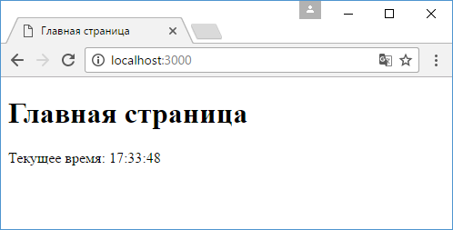
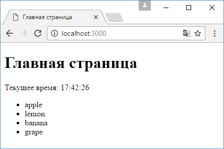

# Хелперы в Handlebars

Хелперы фактически представляют функции, которые возвращают некоторую строку. После получения эту строку можно добавить в любое место представления. Строка может представлять собой в том числе и код html.

Хелперы позволяют оптимизировать создание кода представлений. В частности, мы можем один раз определить функцию хелпера, а затем многократно применять ее в самых различных местах для генерации кода.

Для применения хелперов изменим код файла `app.js`:

```js
const express = require('express')
const hbs = require('hbs')

const app = express()

hbs.registerHelper('getTime', function () {
  var myDate = new Date()
  var hour = myDate.getHours()
  var minute = myDate.getMinutes()
  var second = myDate.getSeconds()
  if (minute < 10) {
    minute = '0' + minute
  }
  if (second < 10) {
    second = '0' + second
  }
  return (
    'Текущее время: ' + hour + ':' + minute + ':' + second
  )
})

app.set('view engine', 'hbs')

app.get('/', function (request, response) {
  response.render('home.hbs')
})

app.listen(3000)
```

Хелпер определяется с помощью функции `hbs.registerHelper()`. Первый параметр функции - название хелпера, а второй - функция, которая возвращает строку. В данном случае возвращается текущее время.

Далее определим представление `home.hbs`:

```hbs
<!DOCTYPE html>
<html>
<head>
    <title>Главная страница</title>
    <meta charset="utf-8" />
</head>
<body>
    <h1>Главная страница</h1>
    <div>{{getTime}}</div>
</body>
<html>
```

Для вызова хелпера в двойных фигурных скобках указывается имя хелпера:



Хелпер может возвращать не просто строку, но и код html. Кроме того, хелперу можно передавать параметры, которые применяются при генерации результата. Например, определим в `app.js` еще один хелпер:

```js
const express = require('express')
const hbs = require('hbs')

const app = express()

hbs.registerHelper('getTime', function () {
  var myDate = new Date()
  var hour = myDate.getHours()
  var minute = myDate.getMinutes()
  var second = myDate.getSeconds()
  if (minute < 10) {
    minute = '0' + minute
  }
  if (second < 10) {
    second = '0' + second
  }
  return (
    'Текущее время: ' + hour + ':' + minute + ':' + second
  )
})

hbs.registerHelper('createStringList', function (array) {
  var result = ''
  for (var i = 0; i < array.length; i++) {
    result += '<li>' + array[i] + '</li>'
  }
  return new hbs.SafeString('<ul>' + result + '</ul>')
})

app.set('view engine', 'hbs')

app.get('/', function (request, response) {
  response.render('home.hbs', {
    fruit: ['apple', 'lemon', 'banana', 'grape'],
  })
})
app.listen(3000)
```

Здесь добавлено определение хелпера `createStringList()`, который в качестве параметра принимает некоторый массив строк и из них создает элемент `<ul>`. Однако чтобы возвращаемое значение расценивалось именно как html, его надо обернуть в функцию `hbs.SafeString()`.

И также изменим файл представления `home.hbs`:

```hbs
<!DOCTYPE html>
<html>
<head>
    <title>Главная страница</title>
    <meta charset="utf-8" />
</head>
<body>
    <h1>Главная страница</h1>
    <div>{{getTime}}</div>
    <div>{{createStringList fruit}}</div>
</body>
<html>
```

В итоге на веб-страницу будет выведен список:



При этом, определив хелпер один раз, мы можем использовать многократно в различных представлениях, передавая ему различные значения.
