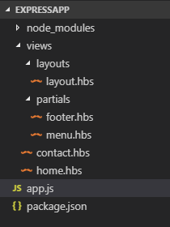
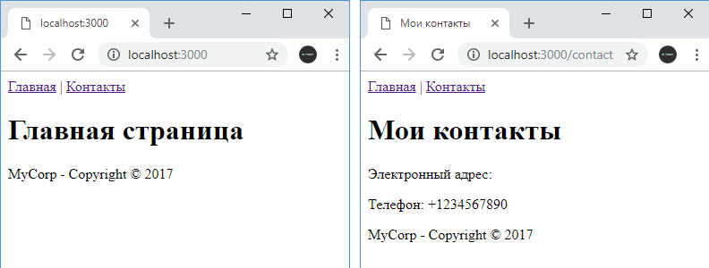

# Layout в Handlebars

Файл `layout` или мастер-страница позволяет определить общий макет всех веб-страниц сайта. Благодаря чему гораздо проще обновлять сайт, определять и менять какие-то общие блоки кода.

Для работы с файлами `layout` установим в проект модуль `express-handlebars` с помощью следующей команды:

```
npm install express-handlebars
```

Пусть в проекте в папке `views/partials` будут определены два частичных представления для меню и футера. Первое представление - `menu.hbs`:

```html
<nav>
  <a href="/">Главная</a> | <a href="/contact">Контакты</a>
</nav>
```

И второе представление - `footer.hbs`:

```html
<footer><p>MyCorp - Copyright © 2017</p></footer>
```

Создадим в проекте в папке `views` новый каталог `layouts` и определим в нем файл `layout.hbs`, который будет определять макет сайта:

```hbs
<!DOCTYPE html>
<html>
<head>
    <title>{{title}}</title>
    <meta charset="utf-8" />
</head>
<body>
    {{> menu}}

    {{{body}}}

    {{> footer}}
</body>
<html>
```

Здесь внедряются частичные представления `menu.hbs` и `footer.hbs`. И, кроме того, здесь также присуствует такое выражение, как `{{{body}}}`. Вместо этого выражения будет вставлять содержимое конкретных представлений.

Затем в папке `views` определим два обычных представления. Представление `contact.hbs`:

```hbs
<h1>{{title}}</h1>
<p>Электронный адрес: {{email}}</p>
<p>Телефон: {{phone}}</p>
```

И представление `home.hbs`:

```html
<h1>Главная страница</h1>
```

Эти представления не содержат элементов `body`, `head`, каких-то общих блоков, так как все они определены в файле `layout.hbs`.

Далее опредлим следующий файл `app.js`:

```js
const express = require('express')
const expressHbs = require('express-handlebars')
const hbs = require('hbs')
const app = express()

// устанавливаем настройки для файлов layout
app.engine(
  'hbs',
  expressHbs({
    layoutsDir: 'views/layouts',
    defaultLayout: 'layout',
    extname: 'hbs',
  })
)
app.set('view engine', 'hbs')
hbs.registerPartials(__dirname + '/views/partials')

app.use('/contact', function (request, response) {
  response.render('contact', {
    title: 'Мои контакты',
    emailsVisible: true,
    emails: ['gavgav@mycorp.com', 'mioaw@mycorp.com'],
    phone: '+1234567890',
  })
})

app.use('/', function (request, response) {
  response.render('home.hbs')
})
app.listen(3000)
```

Для использования файлов `layout` необходимо настроить движок hbs:

```js
app.engine(
  'hbs',
  expressHbs({
    layoutsDir: 'views/layouts',
    defaultLayout: 'layout',
    extname: 'hbs',
  })
)
```

Функция `expressHbs` осуществляет конфигурацию движка. В частности, свойство `layoutsDir` задает путь к папке с файлами `layout` относительно корня каталога проекта. Свойство `defaultLayout` указывает на название файла, который будет использоваться в качестве мастер-страницы. В нашем случае это файл `layout.hbs`, поэтому указываем название этого файла без расширения. И третье свойство - `extname` задает расширение файлов.

В итоге весь проект будет выглядеть следующим образом:



Пример работы приложения:


