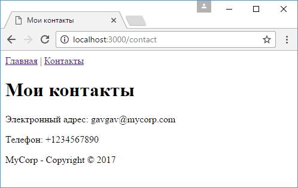

# Частичные представления в Handlebars

Нередко вeб-страницы в приложении используют какие-то общие элементы. Это может быть меню, шапка сайта, футер, другие элементы. Однако здесь встает проблема: если потребуется поменять этот общий элемент, то придется вносить изменения на все веб-страницы, которые используют этот элемент. И было бы гораздо проще определить этот элемент в одном месте, а затем подключать на все страницы.

Решить эту проблему помогают частичные представления (partial views), которые представляют разделяемые общие элементы, которые можно добавлять на обычные представления.

К примеру, мы можем сделать общее меню и общий футер. Для этого создадим для частичных представлений в проекте подкаталог `views/partials`.

Добавим в папку `views/partials` новый файл `menu.hbs`:

```html
<nav>
  <a href="/">Главная</a> | <a href="/contact">Контакты</a>
</nav>
```

Затем также добавим в `views/partials` новый файл `footer.hbs`:

```html
<footer><p>MyCorp - Copyright © 2017</p></footer>
```

Это два частичных представления, которые мы будем подключать в обычные представления.

В папке `views` определим обычное представление `contact.hbs`:

```hbs
<!DOCTYPE html>
<html>
<head>
    <title>{{title}}</title>
    <meta charset="utf-8" />
</head>
<body>
    {{> menu}}

    <h1>{{title}}</h1>
    <p>Электронный адрес: {{email}}</p>
    <p>Телефон: {{phone}}</p>

    {{> footer}}
</body>
<html>
```

Для вставки частичного представления применяется выражение `{{> menu}}`, в котором прописывается имя файла частичного представления без расширения.

Также добавим в папку `views` новое представление, которое назовем `home.hbs`:

```hbs
<!DOCTYPE html>
<html>
<head>
    <title>Главная страница</title>
    <meta charset="utf-8" />
</head>
<body>
    {{> menu}}
    <h1>Главная страница</h1>
    {{> footer}}
</body>
<html>
```

Таким образом, у нас два представления, которые имеют общие элементы. И если нам потребуется добавить какой-нибудь новый пункт меню, то достаточно изменить файл `menu.hbs`.

В итоге весь проект будет выглядеть следующим образом:

- app.js
- node_modules
- views
  - contact.hbs
  - home.hbs
  - partials
    - footer.hbs
    - menu.hbs

В конце изменим файл `app.js`:

```js
const express = require('express')
const hbs = require('hbs')
const app = express()

app.set('view engine', 'hbs')
hbs.registerPartials(__dirname + '/views/partials')

app.use('/contact', function (request, response) {
  response.render('contact', {
    title: 'Мои контакты',
    emailsVisible: true,
    emails: ['gavgav@mycorp.com', 'mioaw@mycorp.com'],
    phone: '+1234567890',
  })
})

app.use('/', function (request, response) {
  response.render('home.hbs')
})
app.listen(3000)
```

Для настройки функционала частичных представлений в коде используется вызов:

```js
hbs.registerPartials(__dirname + '/views/partials')
```

который устанавливает каталог, где располагаются частичные представления.

И если мы запустим проект и обратимся по одному из двух маршрутов: `/` или `/contact`, то после рендеринга представления веб-страница будет содержать меню и футер:


