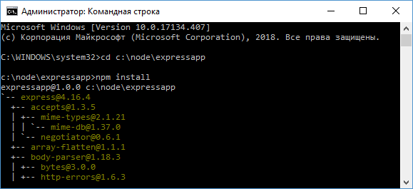
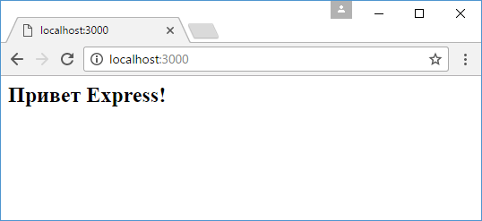
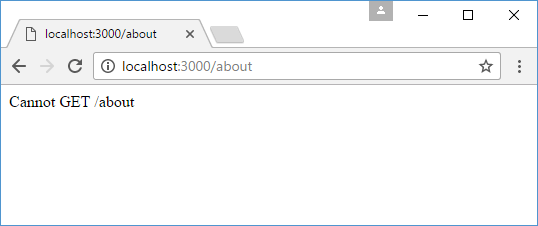

# Начало работы с Express

В этой главе мы рассмотрим создание сервера с помощью фреймворка Express. Казалось бы, зачем нам нужен дополнительный фреймворк, если мы можем воспользоваться готовым модулем `http`, который есть в Node.js API. Однако Express сам использует модуль `http`, но вместе с тем предоставляет ряд готовых абстракций, которые упрощают создание сервера и серверной логики, в частности, обработка отправленных форм, работа с куками, CORS и т. д.

Исходный код фреймворка можно посмотреть в репозитории на гитхабе по адресу [https://github.com/expressjs/express](https://github.com/expressjs/express).

Создадим для проекта новый каталог, который назовем, к примеру, `expressapp`. Для хранения информации обо всех зависимостях проекта определим в этом каталоге новый файл `package.json`:

```json
{
  "name": "expressapp",
  "version": "1.0.0",
  "dependencies": {
    "express": "^4.16.4"
  }
}
```

Далее перейдем к этому каталогу в командной строке/терминале и для добавления всех нужных пакетов выполним команду:

```
npm install
```



Создадим в каталоге проекта новый файл `app.js`:

```js
// подключение express
const express = require('express')
// создаем объект приложения
const app = express()
// определяем обработчик для маршрута "/"
app.get('/', function (request, response) {
  // отправляем ответ
  response.send('<h2>Привет Express!</h2>')
})
// начинаем прослушивать подключения на 3000 порту
app.listen(3000)
```

Для использования Express в начале надо создать объект, который будет представлять приложение:

```js
const app = express()
```

Для обработки запросов в Express определено ряд встроенных функций, и одной из таких является функция `app.get()`. Она обрабатывает GET-запросы протокола HTTP и позволяет связать маршруты с определенными обработчиками. Для этого первым параметром передается маршрут, а вторым - обработчик, который будет вызываться, если запрос к серверу соответствует данному маршруту:

```js
app.get('/', function (request, response) {
  // отправляем ответ
  response.send('<h2>Привет Express!</h2>')
})
```

Маршрут `/` представляет корневой маршрут.

Для запуска сервера вызывается метод `app.listen()`, в который передается номер порта.

Запустим проект и обратимся в браузере по адресу `http://localhost:3000/`:



И что важно, Express опирается на систему маршрутов, поэтому все другие запросы, которые не соответствуют корневому маршруту `/`, не будут обрабатываться:



Теперь изменим файл `app.js`:

```js
const express = require('express')

const app = express()
app.get('/', function (request, response) {
  response.send('<h1>Главная страница</h1>')
})
app.get('/about', function (request, response) {
  response.send('<h1>О сайте</h1>')
})
app.get('/contact', function (request, response) {
  response.send('<h1>Контакты</h1>')
})
app.listen(3000)
```

Теперь в приложении определено три маршрута, которые будут обрабатываться сервером:


