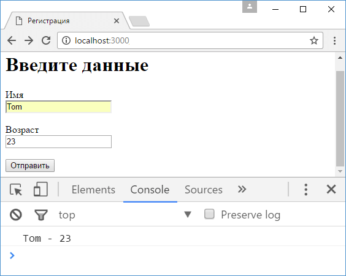

# JSON и AJAX

**JSON** представляет один из самых популярных форматов хранения и передачи данных, и Express имеет все возможности для работы с JSON.

Пусть в папке проекта имеется файл `index.html` со следующим кодом:

```html
<!DOCTYPE html>
<html>
  <head>
    <title>Регистрация</title>
    <meta charset="utf-8" />
  </head>
  <body>
    <h1>Введите данные</h1>
    <form name="registerForm">
      <label>Имя</label><br />
      <input type="text" name="userName" /><br /><br />
      <label>Возраст</label><br />
      <input type="number" name="userAge" /><br /><br />
      <button type="submit" id="submit">Отправить</button>
    </form>
    <script>
      document
        .getElementById('submit')
        .addEventListener('click', function (e) {
          e.preventDefault()
          // получаем данные формы
          let registerForm = document.forms['registerForm']
          let userName =
            registerForm.elements['userName'].value
          let userAge =
            registerForm.elements['userAge'].value
          // сериализуем данные в json
          let user = JSON.stringify({
            userName: userName,
            userAge: userAge,
          })
          let request = new XMLHttpRequest()
          // посылаем запрос на адрес "/user"
          request.open('POST', '/user', true)
          request.setRequestHeader(
            'Content-Type',
            'application/json'
          )
          request.addEventListener('load', function () {
            // получаем и парсим ответ сервера
            let receivedUser = JSON.parse(request.response)
            console.log(
              receivedUser.userName,
              '-',
              receivedUser.userAge
            ) // смотрим ответ сервера
          })
          request.send(user)
        })
    </script>
  </body>
  <html></html>
</html>
```

Здесь, как и в прошлой теме, определена форма с двумя полями для ввода имени и возраста пользователя. Но теперь с помощью обработчика нажатия перехватывается отправка этой формы. Мы получаем значения ее полей и сериализум в объект json, который затем отправляется на сервер с помощью ajax на адрес `/user`.

Далее определим в главном файле приложения - в `app.js` код, который бы принимал отправленные данные:

```js
const express = require('express')

const app = express()
// создаем парсер для данных в формате json
const jsonParser = express.json()

app.post('/user', jsonParser, function (request, response) {
  console.log(request.body)
  if (!request.body) return response.sendStatus(400)

  response.json(request.body) // отправляем пришедший ответ обратно
})

app.get('/', function (request, response) {
  response.sendFile(__dirname + '/index.html')
})

app.listen(3000)
```

Прежде всего для получения данных в формате json необходимо создать парсер с помощью функции `json`:

```js
const jsonParser = express.json()
```

В реальности данный парсер будет использовать модуль `bodyParser`, который использовался нами ранее для парсинга данных отправленной формы.

И поскольку с клиентом мы взаимодействуем через формат json, то данные клиенту отправляются с помощью метода `response.json()`:

```js
app.post('/user', jsonParser, function (request, response) {
  console.log(request.body)
  if (!request.body) return response.sendStatus(400)

  response.json(request.body) // отправляем пришедший ответ обратно
})
```

Следует отметить, что в принципе мы можем отправить объект и с помощью стандартного метода `response.send(request.body)`. В реальности метод `response.json()` устанавливает для заголовка `Content-Type` значение `application/json`, серилизует данные в json с помощью функции `JSON.stringify()` и затем отправляет данные с помощью `response.send()`.

Для получения данных, как и в случае с формами, используются выражения типа `request.body.userName`, где `request.body` инкапсулирует данные формы, а `userName` - ключ данных.

При обращении к корню веб-приложения пользователю будет отправляться содержимое файла `index.html` с формой ввода данных.

Запустим приложение и обратимся к корню веб-сайта. Введем какие-нибудь данные и после отправки в консоли браузера отобразится ответ сервера:


