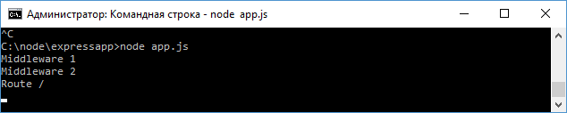
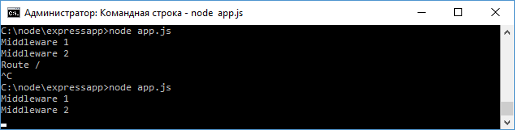
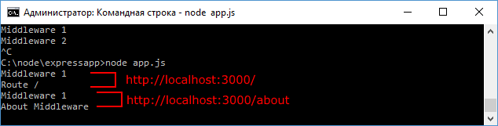

# Конвейер обработки запроса и middleware

Когда фреймворк Express получает запрос, этот запрос передается в конвейер обработки. Конвейер состоит из набора компонентов или middleware, которые получают данные запроса и решают, как его обрабатывать.

Так, в предыдущей теме файл приложения выглядел следующим образом:

```js
const express = require('express')

const app = express()
app.get('/', function (request, response) {
  response.send('<h1>Главная страница</h1>')
})
app.get('/about', function (request, response) {
  response.send('<h1>О сайте</h1>')
})
app.get('/contact', function (request, response) {
  response.send('<h1>Контакты</h1>')
})
app.listen(3000)
```

Здесь конвейер обработки состоял из вызовов `app.get()`, которые сравнивали запрошенный адрес с маршрутом, и если между адресом и маршрутом было соответствие, то данный запрос обрабатывался методом `app.get()`.

При необходимости мы можем встроить в конвейер обработки запроса на любом этапе любую функцию middleware. Для этого применяется метод `app.use()`. Так, изменим файл `app.js` следующим образом:

```js
const express = require('express')

const app = express()
app.use(function (request, response, next) {
  console.log('Middleware 1')
  next()
})
app.use(function (request, response, next) {
  console.log('Middleware 2')
  next()
})

app.get('/', function (request, response) {
  console.log('Route /')
  response.send('Hello')
})
app.listen(3000)
```

Функция, которая передается в `app.use()`, принимает три параметра:

- `request`: данные запроса
- `response`: объект для управления ответом
- `next`: следующая в конвейере обработки функция

Каждая из функций middleware просто выводит на консоль сообщение и в конце вызывает следующую функцию с помощью вызова `next()`.

При запуске приложения после обращения по адресу `http://localhost:3000/` последовательно отработают все три middleware:



Однако необязательно вызывать все последующие middleware, мы можем на каком-то этапе остановить обработку:

```js
const express = require('express')

const app = express()
app.use(function (request, response, next) {
  console.log('Middleware 1')
  next()
})
app.use(function (request, response, next) {
  console.log('Middleware 2')
  response.send('Middleware 2')
})

app.get('/', function (request, response) {
  console.log('Route /')
  response.send('Hello')
})
app.listen(3000)
```

Теперь обработка завершается на Middleware 2, так как в этом методе происходит отправка ответа с помощью `response.send()`, а вызова следующей функции через `next()`:



Функции middleware также могут сопоставляться с определенными маршрутами. Например:

```js
const express = require('express')

const app = express()
app.use(function (request, response, next) {
  console.log('Middleware 1')
  next()
})
app.use('/about', function (request, response, next) {
  console.log('About Middleware')
  response.send('About Middleware')
})

app.get('/', function (request, response) {
  console.log('Route /')
  response.send('Hello')
})
app.listen(3000)
```

В данном случае вторая функция middleware явно сопоставляется с маршрутом `/about`, поэтому она будет обрабатывать только запрос `http://localhost:3000/about`. Первая функция middleware по прежнему обрабатывает все запросы:



## Пример middleware

Middleware помогают выполнять некоторые задачи, которые должны быть сделаны до отправки ответа. Стандартная задача - логгирование запросов.

Например, изменим файл `app.js` следующим образом:

```js
const express = require('express')
const fs = require('fs')

const app = express()
app.use(function (request, response, next) {
  let now = new Date()
  let hour = now.getHours()
  let minutes = now.getMinutes()
  let seconds = now.getSeconds()
  let data = `${hour}:${minutes}:${seconds} ${
    request.method
  } ${request.url} ${request.get('user-agent')}`
  console.log(data)
  fs.appendFile('server.log', data + '\n', function () {})
  next()
})

app.get('/', function (request, response) {
  response.send('Hello')
})
app.listen(3000)
```

Здесь с помощью объекта `request` получаем различную информацию о запросе и добавляем ее в файл `server.log`, используя модуль `fs`.
