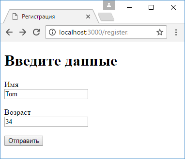
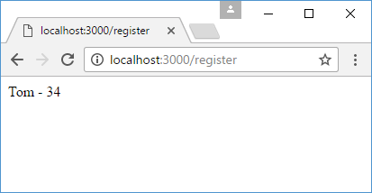

# POST-запросы и отправка форм

При оправке каких-то сложных данных обычно используются формы. Рассмотрим, как получать отправленные данные в Express.

Для получения данных форм из запроса необходимо использовать специальный пакет [body-parser](https://www.npmjs.com/package/body-parser). Поэтому вначале добавим его в проект с помощью команды

```
npm install body-parser --save
```

Определим в папке проекта новый файл `register.html`:

```html
<!DOCTYPE html>
<html>
  <head>
    <title>Регистрация</title>
    <meta charset="utf-8" />
  </head>
  <body>
    <h1>Введите данные</h1>
    <form action="/register" method="post">
      <label>Имя</label><br />
      <input type="text" name="userName" /><br /><br />
      <label>Возраст</label><br />
      <input type="number" name="userAge" /><br /><br />
      <input type="submit" value="Отправить" />
    </form>
  </body>
</html>
```

Здесь определены два поля для ввода имени и возраста пользователя. После нажатия на кнопку данные будут уходить по адресу `/register`.

В файле `app.js` определим следующий код:

```js
const express = require('express')
const bodyParser = require('body-parser')

const app = express()

// создаем парсер для данных application/x-www-form-urlencoded
const urlencodedParser = bodyParser.urlencoded({
  extended: false,
})

app.get('/register', urlencodedParser, function (
  request,
  response
) {
  response.sendFile(__dirname + '/register.html')
})
app.post('/register', urlencodedParser, function (
  request,
  response
) {
  if (!request.body) return response.sendStatus(400)
  console.log(request.body)
  response.send(
    `${request.body.userName} - ${request.body.userAge}`
  )
})

app.get('/', function (request, response) {
  response.send('Главная страница')
})

app.listen(3000)
```

Прежде всего для получения отправленных данных необходимо создать парсер:

```js
const urlencodedParser = bodyParser.urlencoded({
  extended: false,
})
```

Поскольку данные отправляются с помощью формы, то для создания парсера применяется функция `urlencoded()`. В эту функцию передается объект, устанавливающий параметры парсинга. Значение `extended: false` указывает, что объект - результат парсинга будет представлять набор пар ключ-значение, а каждое значение может быть представлено в виде строки или массива.

При переходе по адресу `/register` будет срабатывать метод `app.get`, который отправит пользователю файл `register.html`.

Так как данные отправляются с помощью метода `POST`, то для обработки определяем функцию `app.post("/register",...)`. Первый параметр функции - адрес, на который идет отправка - `/register`. Стоит отметить, что в данном случае с одинм адресом `/register` связаны две функции, только одна обрабатывает запросы `get`, а другая - запросы `post`. Второй параметр - выше созданный парсер. Третий параметр - обработчик:

```js
app.post('/register', urlencodedParser, function (
  request,
  response
) {
  if (!request.body) return response.sendStatus(400)
  console.log(request.body)
  response.send(
    `${request.body.userName} - ${request.body.userAge}`
  )
})
```

Для получения самих отправленных данных используем выражения типа `request.body.userName`, где `request.body` инкапсулирует данные формы, а `userName` - ключ данных, который соответствует значению атрибута name поля ввода на html-странице:

```html
<input type="text" name="userName" />
```

Запустим приложение и обратимся к странице `register.html`:



После отправки введенные данные будут получены в функции `app.post("/register",...)`, которая выведет результат обработки:


