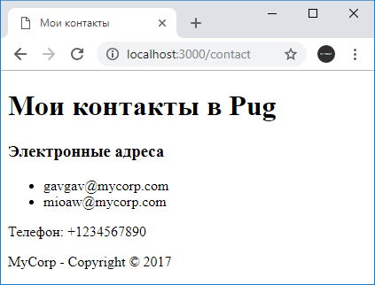

# Частичные представления и layout в Pug

## Частичные представления

Pug позволяет внедрять одни предствления в другие. Например, определим в проекте в папке `views` новый файл `footer.pug`:

```html
<footer><p>MyCorp - Copyright © 2017</p></footer>
```

Подключим его в файл `contact.pug`:

```
<!DOCTYPE html>
<html>
<head>
    <title>#{title}</title>
    <meta charset="utf-8" />
</head>
<body>

    <h1>#{title} в Pug</h1>

    if emailsVisible
        <h3>Электронные адреса</h3>
        <ul>
            each email in emails
                <li>#{email}</li>
        </ul>
    else
        <h3>Электроннный адрес отсутствует</h3>
    <p>Телефон: #{phone}</p>

    include footer.pug

</body>
<html>
```

Для подключения частичного представления применяется директива `include`, после которой идет путь к подключаемому представлению.

Сам файл приложение остается тем же, что и в прошлой теме:

```js
const express = require('express')

const app = express()

app.set('view engine', 'pug')

app.use('/contact', function (request, response) {
  response.render('contact', {
    title: 'Мои контакты',
    emailsVisible: true,
    emails: ['gavgav@mycorp.com', 'mioaw@mycorp.com'],
    phone: '+1234567890',
  })
})

app.use('/', function (request, response) {
  response.send('Главная страница')
})
app.listen(3000)
```



Подобным образом можно определить несколько представлений и подключать их в различные места стандартного представления.

## Layout

Несколько представлений могут иметь общие блоки интерфейса, например, футер. Что если мы захотим пометь текст в футере? Тогда нам придется менять код во всех представлениях, где футер используется. Это не очень рационально. И в этом случае лучше использовать мастер-страницы или `layout`, который позволяют определить общие блоки интерфейса для других представлений.

Например, добавим в папку `views` новый файл `layout.pug`:

```
<!DOCTYPE html>
<html>
<head>
    block title
    <meta charset="utf-8" />
</head>
<body>
    block content
    include footer.pug
</body>
<html>
```

С помощью директивы `block` определяет блок, в который будет вставляться некоторое содержимое. На момент определения этого представления мы не знаем, что это будет за содержимое. Оно будет определяться в других представлениях, которые будут использовать данный `layout`. И в данном случае определяются два блока с именами `title` и `content`.

Также, как в и в любом представлении, мы можем подключать другие представления. В частности, здесь подключается футер из `footer.pug`, который обычно является общим элементом для большинства страниц веб-сайта.

Теперь определим представление `contact.pug`, которое будет использовать данный `layout`:

```
extends layout.pug

block title
    <title>#{title}</title>

block content

    <h1>#{title} в Pug</h1>
    if emailsVisible
        <h3>Электронные адреса</h3>
        <ul>
            each email in emails
                <li>#{email}</li>
        </ul>
    else
        <h3>Электронный адрес отсутствует</h3>
    <p>Телефон: #{phone}</p>
```

Для подключения мастер-страницы в представление применяется директива `extends`, после которой указывается путь к файлу.

Поскольку на мастер-странице определены два блока `title` и `content`, то в данном случае мы определяем для каждого из этих блоков содержимое и это содержимое затем вставляется на место соответствующих блоков на мастер-сраницу.
