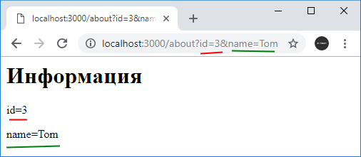
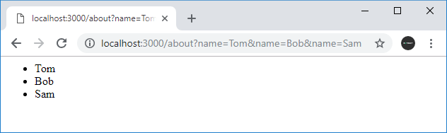
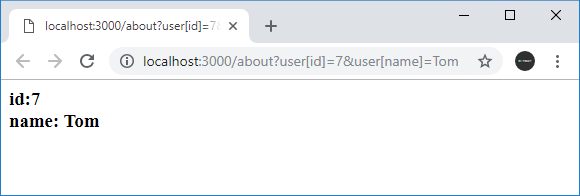

# Передача данных приложению. Параметры строки запроса

Одним из способов передачи данных в приложение представляет использование параметров строки запроса. **Строка запроса** (query) - фактически это часть запрошенного адреса, которая идет после знака вопроса. Например, в запросе `http://localhost:3000/about?id=3&name=Tome` часть `id=3&name=Tome` представляет строку запроса.

Строку запроса образуют параметры. После названия каждого параметра после знака равно (`=`) идет его значение. Друг от друга параметры отделяются знаком амперсанда. Например, в адресе выше использовалось два параметра: параметр `id` имеет значение `3` и параметр `name` имеет значение `Tom`.

В express мы можем получить параметра строки запроса через свойство `query` объекта `request`, который передается в функцию обработки запроса. Например:

```js
const express = require('express')

const app = express()
app.get('/', function (request, response) {
  response.send('<h1>Главная страница</h1>')
})
app.use('/about', function (request, response) {
  let id = request.query.id
  let userName = request.query.name
  response.send(
    '<h1>Информация</h1><p>id=' +
      id +
      '</p><p>name=' +
      userName +
      '</p>'
  )
})

app.listen(3000)
```

С помощью выражения `request.query` мы можем получить все параметры строки запрос в виде объекта javascript, а с помощью выражения `request.query.название_параметра` мы можем обратиться к каждому отдельному параметру.



## Передача массивов

Подобным образом мы можем передавать массивы данных:

```js
const express = require('express')

const app = express()
app.get('/', function (request, response) {
  response.send('<h1>Главная страница</h1>')
})
app.use('/about', function (request, response) {
  console.log(request.query)
  let names = request.query.name
  let responseText = '<ul>'
  for (let i = 0; i < names.length; i++) {
    responseText += '<li>' + names[i] + '</li>'
  }
  responseText += '</ul>'
  response.send(responseText)
})

app.listen(3000)
```

В данном случае в приложение будет передаваться параметр `name`, который представляет массив.



## Передача сложных объектов

Также можно передавать более сложые объекты, которые состоят из множества свойств:

```js
const express = require('express')

const app = express()

app.use('/about', function (request, response) {
  console.log(request.query)
  let id = request.query.user.id
  let name = request.query.user.name

  response.send(
    '<h3>id:' + id + '<br>name: ' + name + '</h3>'
  )
})

app.listen(3000)
```

В данном случае мы получаем объект `user`, который содержит два свойства `id` и `name`, например, `user: { id: '7', name: 'Tom' }` .



При передаче в строке запроса свойства объекта помещаются в квадратные скобки: `user[id]`.
